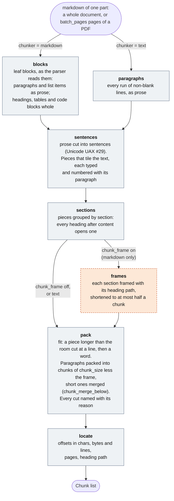
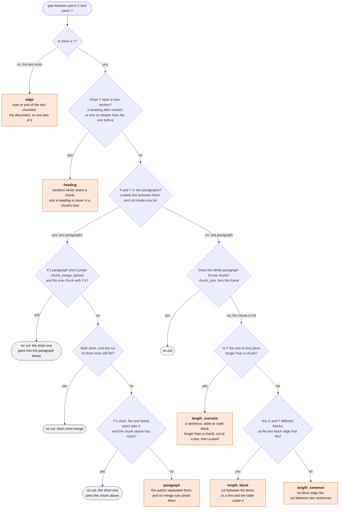
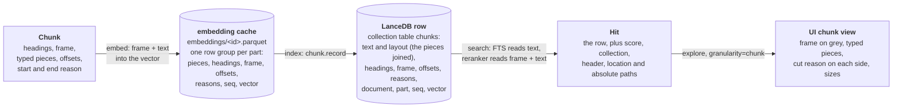

<p align="center">
  
</p>

<h1 align="center">haskie</h1>

<p align="center">
  <strong>Haskie "has a key" to your private bookshelf, giving your AI agents your exact taste.</strong>
</p>

The web is an average of everyone. Your bookshelf is not. haskie turns the papers, books, manuals
and notes you own and actually trust — or simply the documents that matter for your AI flows —
into private, searchable collections, and hands them to your AI agents over MCP, so they answer
from your sources instead of whatever ranked first today.

```sh
uv tool install haskie
haskie run          # http://127.0.0.1:8000 — web UI, REST API, MCP server
```

## The problem

You already know which sources are right. Your agent doesn't.

- **It answers from the internet's median.** Ask about a niche topic and you get the blog post that
  won SEO in 2019, not the one book that settles the question.
- **You cannot vouch for what it cited.** Web search pulls in pages you have never read, from
  authors you have never heard of, and the answer arrives with the same confidence either way.
- **Your best sources are unreadable to it.** The PDFs, the standards, the internal decision
  records — all sitting in a folder no tool can search by meaning.
- **Pasting doesn't scale.** Dropping a 400-page PDF into a chat burns the context window and still
  loses the other nine documents you needed.
- **"Just use RAG" is a weekend project.** Parser, chunker, embeddings, a vector store, a reranker,
  a queue for when it all takes ten minutes — and now you maintain it.
- **Cloud knowledge bases want your documents.** Upload, accept the terms, hope the retention
  policy holds.

## The fix

Import your documents once — PDFs, markdown, office files — and curate a collection per topic:
*the three coffee-roasting books worth reading*, *our internal architecture decisions*, *the
standards that actually apply to this hardware*. The same document can sit in as many collections
as it belongs to. haskie converts, chunks and indexes on your machine, and computes each embedding
once however many collections share it. Then any MCP client — Claude Code, Claude Desktop, your
own agent — searches a collection by meaning, by keyword, or both.

- **Trusted sources, not search results.** You decide what goes in. Nothing else answers.
- **A collection per topic.** Point an agent at the collections that matter for the question at
  hand; a document is imported once and reused everywhere it belongs.
- **Local and private.** Your files, your machine, loopback by default. No account, no upload,
  nothing redistributed.
- **Agent-native.** MCP server and REST API from the same app, plus a web UI to curate with.
- **Nothing to assemble.** Conversion, chunking, embeddings, hybrid search, reranking and a durable
  indexing pipeline ship in one command.

Taste does not scale by explaining it. It scales by indexing it.

## Five minutes to a working collection

```sh
uv tool install haskie      # or `uv tool install .` from a checkout
haskie init                 # create ~/.haskie and its database
haskie run                  # web UI, REST API and MCP server on http://127.0.0.1:8000
haskie stop                 # stop the server running for this home
haskie destroy              # delete ~/.haskie and everything in it
```

Open the UI, drop files into Documents (they are converted and embedded on import), make a
collection, add the documents that belong to it. Then hand it to Claude Code:

```sh
haskie install claude       # MCP server, a skill saying how, and a rule saying when
```

and ask it something only your documents know.

`init` is idempotent, so it is also how a home is brought up to date after an upgrade; `run` does
the same work at startup, so `init` is only needed to do it first. Both take `--home` (or
`HASKIE_HOME`) to keep the data somewhere else, and `run` takes `--host`, `--port` and `--reload`.
It binds loopback by default: the home directory is one user's documents, and nothing in the app
authenticates a caller.

A home written by a build with a different storage shape is not migrated: the app refuses to start
against it and says so. Run `haskie destroy` and import the documents again. This release changes
the shape (Structure-Aware Chunking, see [Chunking](#chunking)), so an existing home is refused,
whichever build wrote it. Then run `haskie install claude` again. The installed skill sits outside
the home, and this release renames tool parameters and result fields it names (`doc` is now
`document`).

One haskie per home: the app takes an exclusive lock on the home directory as its first startup
step, and a second one refuses, naming the process that has it. A home is one SQLite file and one
durable indexing pipeline, and two executors polling the same queues take each other's work. The lock
lives in the app rather than in `run`, so any other ASGI server is held to it too; the port is not
the guard it looks like, because the server runs its whole startup before it binds. `haskie
ensure` is the idempotent form: it starts a server only if nothing is serving yet, and `haskie
stop` is the other end of it: it finds the holder through that same lock and asks it to shut down
gracefully, which is what a detached `ensure` leaves no terminal to do.

`destroy` asks before it deletes and prints what would be lost first. It refuses any directory
that is not a haskie home, so a mistyped `--home` cannot take the wrong tree with it; `--yes`
skips the prompt. Nothing is backed up, and a running server should be stopped first (`haskie
stop`).

An installed `haskie` serves the web UI as well as the API. Run from a checkout it needs `mise run
build` first; without the built UI the app still runs, API and MCP only.

## MCP: what your agent gets

Endpoint `POST http://127.0.0.1:8000/mcp`. The REST API is the same handlers; its OpenAPI
document is at `/schema/openapi.json`, and `web/src/schema.d.ts` is generated from it.

Twelve tools, in three groups:

- **Search** — `search_excerpts` is the search, and what an agent answers from: passages merged
  from adjacent chunks and widened to the line or the whole sentences around them. Each one
  carries a `header` (its heading path) and a `location` to cite. `search_sources` answers which
  documents, and which collections, cover the topic. Use it for a reading list, or when
  `search_excerpts` came back empty or beside the point. It returns one row per document with its
  best chunk and its hottest sections, plus the smallest set of collections holding every row.
  `set_session_collections` records that set for the rest of the conversation. Every search takes
  an optional comma-separated `collections`; without it, the session's selection; without that,
  everything.
- **Catalogue** — `list_collections`, `get_collection`, `list_collection_documents`,
  `list_documents`, `get_document`. Paged, sortable, and each collection carries the description
  that says what it is for.
- **Write** — `add_document` imports a local file by absolute path, `add_document_to_collection`
  attaches and queues its index, `remove_document_from_collection` detaches,
  `describe_document` sets what a document is about. Creating and deleting collections, and
  deleting documents, stay in the web UI.

Every tool that searches or changes something also takes an optional session id. Pass the same id
on each call and the Sessions view replays what that conversation searched, imported and attached,
and each operation it started names the conversation as its origin.

REST only: `GET /api/search/text` (BM25, no model, paged), `GET /api/search/explore` (the same
retrieval at chunk, passage or excerpt granularity), `GET /api/collections/{c}/search` (one
collection with per-call tuning), plus staging uploads, settings, operations, insights and the
document renderers the UI drives.

### Claude Code

```sh
haskie install claude       # --scope user (default) or project, --url for a different endpoint
```

Four things, because the tools alone are not enough:

- **The MCP entry**, registered with `claude mcp add --transport http`. Print it instead of
  running it if the `claude` CLI is not on PATH.
- **A skill** at `~/.claude/skills/haskie/SKILL.md`, whose trigger names the collections this home
  actually holds — so it fires on *coffee roasting* rather than on the word "documents". Its body
  is the reference an agent works from: `search_excerpts` first, `search_sources` and
  `set_session_collections` for a reading list or when it finds nothing, every tool's arguments and
  the fields it returns, which fields to cite, and what a 503, 404 or 422 means.
- **A rule** at `~/.claude/rules/haskie.md`, loaded into every session. A skill is only weighed
  when Claude picks a tool for a task, so a plain "what is X", a plan, or a moment of doubt never
  reaches it and gets answered from memory. The rule says to search the collections first in all
  of those cases, and before any web search on a topic they cover — the same mechanism Context7
  uses. Re-run `haskie install claude` after adding a collection to refresh the skill and the rule.
- **A SessionStart hook** running `haskie ensure --no-wait`, so a session that starts while
  nothing is serving brings the server up. It costs one loopback request when haskie is already
  running, which is the usual case.

The hook starts the server, but it does not rescue the session that ran it: Claude Code connects
to the MCP endpoint while the hook is still working. So the first session after a cold boot has no
haskie tools and every session after it does. Keep `haskie run` up — a launchd agent, or just the
terminal you already left it in — if that first session matters.

Transport is HTTP, not stdio. litestar-mcp serves MCP `2026-07-28`, which replaced `initialize`
with `server/discover`; a stdio client that opens with `initialize` gets a 404 and never connects.

## Search that earns the trust you put in the collection

A curated collection is only as good as the retrieval over it, so the retrieval is not an
afterthought.

User-level defaults with per-collection overrides (`limit`, `candidates`, `mode`, `fusion`,
`rrf_k`, `vector_weight`, `bm25_weight`, `nprobes`, `refine_factor`, `reranker`,
`reranker_model`); a single-collection search
(`GET /api/collections/{c}/search`) also accepts them per call. `mode`: `hybrid` (vector + BM25,
fused), `vector`, `fts`; without an embedding profile everything is `fts`. `fusion`: `rrf`
(reciprocal rank fusion, `rrf_k`) or `linear` (weighted sum of normalized scores; the two weights
are normalized together). `reranker = cross-encoder` rescores the `candidates` of any mode (vector,
fts or hybrid) with a fastembed cross-encoder (`reranker_model`).

Full-text search (`GET /api/search/text`, REST only — it is what the UI's full-text scope calls)
is the session-free alternative: one BM25 query over every collection at once, or over the
comma-separated `collections`, with no embedding model and nothing to set up first. Scores are raw
BM25 rather than fused ranks, because one lexical scorer with the same tokenizer answers
everywhere, so two collections are on one scale; normalizing per collection would put every
collection's rank-1 chunk on page one. A document that sits in several of the collections searched
is reported once per chunk, not once per collection. The result is paged (`page_size` up to 200,
`next_cursor` back in as `cursor`, at most 1000 results deep): the cursor is an opaque offset bound
to the query, since a full-text query cannot be filtered by score. Every page recomputes the
ranking, so a document indexed between two pages can move a hit across a page boundary, and a
collection created or deleted meanwhile invalidates the cursor (422). A collection with no
full-text index yet — one in the middle of its first index — contributes nothing rather than making
the whole query wait for it.

`search_excerpts` (`GET /api/search/excerpts`) is what an agent answers from. It asks every
collection in scope at once — the comma-separated `collections` if the call carries them, else the
session's collections, else every collection in the home: the query is embedded once and each model
is checked once for the whole fan-out, the collections are read in parallel (up to 8 at a time),
and the per-collection rankings are fused by rank (reciprocal rank fusion, `rrf_k`), because scores
from two indexes are not comparable. A chunk that two of the collections both hold counts once. A
score is therefore an RRF score, or the cross-encoder's when `reranker = cross-encoder` — one
rerank pass over the merged candidates. A single collection in scope keeps its own scores. A
collection deleted since the session chose it is skipped; a collection that fails to answer fails
the search, rather than leaving a hole that reads as "no match".

What comes back is excerpts, not chunks. Every chunk carries `seq`, its 1-based position among its
document's chunks. So hits that landed on consecutive chunks are one run, not several quotes of
the same paragraph. The run's text is read back out of the source markdown and widened on each
side: to the nearest line break, else to the outermost whole sentence within 300 characters, else
to 300 characters. That is a passage. An excerpt is a passage with the irrelevant parts removed.
Today it is the passage unchanged, and the type is where that trimming will go. So an excerpt
usually begins and ends where a line or a sentence does. Where the 300-character cap stops the
widening, it can begin or end mid-word. It carries the `header` (its heading path, joined) and the
`location` (`doc p.3-4 L10-20`) to cite it by.

`search_sources` (`GET /api/search/sources`) answers the question that comes first: which documents
cover this, and which collections hold them. One row per distinct document, scored as the harmonic
mean of its best chunk and the sum of every chunk it matched, so a document that answers throughout
outranks one that answers once, while the mean stays under twice the best chunk, so many weak
chunks never outrank one strong one. Inside each row are its top `sections` hot sections — the
heading breadcrumbs the matching chunks sit under, weighted the same way. Beside the documents
comes `collections`: the smallest set of collections that covers every document returned, meant to
be handed to `set_session_collections`, so the rest of the conversation searches the user's shelf
on that subject rather than everything they own. The scope rule is the one above.

`GET /api/search/explore` is the same retrieval with a `granularity` switch — `chunk`, `passage` or
`excerpt` — for seeing what each stage produced. It is REST only. The UI's Explore view calls it
at the granularity picked there, and its chunk view shows a chunk as the models read it.

The four shapes a search answers with, from the finest:

| shape | what it is | who asks for it |
| --- | --- | --- |
| chunk (`Hit`) | one indexed cut of the markdown, with its score | `explore?granularity=chunk`, `/api/search/text`, `/api/collections/{c}/search` |
| passage | consecutive matched chunks of one document, widened to the line or whole sentences | `explore?granularity=passage` |
| excerpt | a passage without the parts that do not answer (today: the passage itself) | `search_excerpts`, `explore?granularity=excerpt` |
| source | one document: its score, best chunk, hot sections and the collections holding it | `search_sources` |

Every setting has a title and a definition (`msgspec.Meta` on the field, served as
`/api/options` → `docs` and shown in the UI). So you tune search in the UI, not by reading this
file.

## Chunking

haskie cuts every document into chunks with Structure-Aware Chunking. A chunk follows the
author's structure: it never spans two sections, and it cuts at a blank line before it cuts
inside a paragraph. Every rule, with the code that applies it, is in
[`src/haskie/indexing/chunking.md`](src/haskie/indexing/chunking.md).

Four settings steer it, for all collections or per collection. Sizes are in characters.

| setting | shown as | default | what it does |
| --- | --- | --- | --- |
| `chunker` | Chunker | `markdown` | `markdown` reads the structure: headings, lists, tables, code. `text` splits on blank lines and sentences only. |
| `chunk_size` | Chunk size (characters) | 1200 | the most one chunk holds, its heading path included |
| `chunk_merge_below` | Merge short paragraphs (% of chunk size) | 66 | a paragraph shorter than this share of `chunk_size` is merged with its neighbours |
| `chunk_frame` | Prepend heading path | on | the models read each chunk with its heading path in front |

### The steps

`chunk.pipeline(settings)` builds the steps, and each one hands its output to the next. Chunking
runs once per part: the whole document, or `batch_pages` pages of a PDF.



### Where a chunk is cut

Every gap between two pieces either stays inside a chunk or becomes a cut. The step that cuts
names the reason, and every chunk keeps the reason on each side (`start_reason`, `end_reason`).



- Every heading after content starts a new section, and sections never share a chunk. A heading
  is never part of a chunk's text: it is the chunk's heading path (`headings`). A section of
  headings alone is the one exception: its heading lines are its text.
- Only a blank line separates two paragraphs. A line that leads straight into a table is one
  paragraph with it, and a whole list is one paragraph.
- With `chunk_frame` on, the heading path counts toward `chunk_size`. A path longer than half
  a chunk loses its outermost headings first.
- Chunks never overlap. The heading path in front gives each chunk the context a neighbour's
  sentences would, as in Contextual Retrieval.
- A page marker (`<!-- page 3 -->`) counts as whitespace. No cut falls on one, and no chunk text
  holds one. Its offset still gives each chunk its pages.
- Sentences follow the Unicode sentence rules (UAX #29), so no language setting is needed.

### What is stored where



The embedding cache keeps a chunk's pieces. A collection's LanceDB table keeps the text joined
from them, plus `layout`: where each piece starts and its type. The vector was computed from the
frame and the text together, and the reranker reads the same. The full-text index reads the text
alone, so a heading's words do not match every chunk of its section.

## How it works

Documents and collections are two different things, and the storage follows that.

A **document** is imported once, under a name that never changes, and belongs to no collection.
Intake is two-phase: an upload lands in `staging/` and commits nothing; the import fixes the name
(the original suffix is kept, because it decides the parser), creates the row, moves the file into
the document's own folder and starts the pipeline: `queued` → `converting` → `embedding` →
`imported` (or `error` / `cancelled`). Conversion happens once here (pdf-inspector page-wise for
PDF, anydoc for office formats), so `parser` and `skip_ocr_pages` are chosen at import and stored
on the document; the import also pre-warms the embedding cache under the user's default chunk
settings. The preview (first 10 PDF pages) is built on first open.

A **collection** is a set of documents with one LanceDB index and its own chunk and search
settings. Adding an imported document to a collection is an indexing operation with a status of
its own (`pending` → `indexing` → `indexed` / `error`), independent per collection: it makes sure
the embedding the collection's chunk settings call for exists — computing it only when no
collection asked for that exact combination before — and writes the rows out of that cache into
the collection's table. Removing a document from a collection deletes its rows there and nothing
else; deleting a collection touches no document; deleting a document takes it out of every
collection, then drops its folder.

The **embedding cache** is what makes a document cheap to share. Every computed embedding is one
parquet file under the document (`embeddings/<id>.parquet`, one row group per convert part) plus
one `embeddings` row, keyed by a canonical URN of everything the rows depend on —
`document:<document>;model:<model>;chunk_size:<n>;chunk_merge_below:<n>;chunk_frame:<b>;chunker:<c>;chunk_version:<v>;parser:<p>;skip_ocr_pages:<b>`
— hashed with sha256 to the id. Same inputs, same id, computed once; two collections asking for the
same missing entry at the same moment share one run (DBOS deduplication on the id). The
accelerator is not in the key: it selects where a model runs, not what it computes.

### Where everything lives

Plain files in a directory you can back up, inspect or delete. No opaque store.

```
~/.haskie/
  cache/models/            compiled CoreML models (ONNX Runtime writes it; safe to delete)
  haskie.db               SQLite (aiosqlite, WAL): settings, documents, collections, memberships,
                           embeddings metadata, sessions, plus DBOS workflow tables. One schema
                           snapshot, stamped in PRAGMA user_version; no upgrade path.
  staging/<uuid>.<ext>    uploads not yet imported; swept after a day by the nightly run
  documents/<sh>/<doc>/
    original.<ext>            the file as imported
    original.<ext>.md         full conversion (assembled from the parts at import)
    parts/NNNNNN.md           per micro-batch of `pipeline.batch_pages` pages; kept, because every
                              collection re-chunks from the same part boundaries
    preview/                  source (pdf cut to 10 pages / image / text / html) + preview.md
    embeddings/<id>.parquet   one cached embedding per chunk settings x model (see above)
  collections/<sh>/<name>/
    index/                    LanceDB table "chunks"
```

`<sh>` is the shard directory of the entry: the first byte of the SHA-1 of its name, in hex
(`home.shard`). Ten thousand documents therefore spread over 256 directories instead of filling
one.

### Indexing that survives a crash

Indexing a shelf of books takes minutes to hours. Closing the laptop mid-run should cost the
current step, not the run — so the pipeline is durable, resumable and cancellable by design.

Durable execution is [DBOS](https://docs.dbos.dev) on the same SQLite file. Three pipeline-shaped
workflows share one machinery: `import_document` (convert, then pre-warm the cache),
`ensure_embedding` (chunk and embed one document under one set of parameters, deduplicated by the
cache id so it runs once however many callers wait on it) and `index_collection_document` (ensure
the embedding, then write it into one collection's table). Each plans its stage into micro-batches
of `pipeline.batch_pages` pages and cuts convert and embed into at most
`pipeline.document_parallelism` contiguous slices (0 = as many as that stage's share of the CPU
budget). Every slice is one child `stage_slice` workflow with a durable step per micro-batch — so
one large document spreads over the available slots, while a document still costs a handful of
workflows rather than one per micro-batch. The index stage is one `stage_slice` child on the
collection's partition, so LanceDB has one writer per collection and the full-text index is
rebuilt once, as that child's last step.

**The words this app counts work in.** An *operation* is what the user asked for — import a
document, index one into a collection, index or delete a whole collection, delete a document,
maintain a collection, download a model. A *job* is one stage of an operation: convert, embed or
index. A *task* is one micro-batch below a job, and one durable step. "Workflow" is DBOS's word
for whatever runs any of the three; the API, the UI and this document never use it.

Queues are named for what they carry: an `operation.*` queue holds operations, which are made of
jobs and tasks and mostly wait on them, and a `task.*` queue holds the work itself.

| queue | concurrency | runs |
| --- | --- | --- |
| `operation.indexing` | twice `pipeline.cpu_budget`, capped at 64 | one import or collection-index orchestrator per document |
| `operation.embedding` | same | `ensure_embedding`, one per cache id (its own queue: the orchestrators wait on it) |
| `operation.collection` | 2 | "index all", collection delete, document delete |
| `operation.downloads` | 2 | model downloads (`ensure_model`) |
| `operation.maintenance` | 4 | debounced maintenance, nightly housekeeping |
| `task.converting` | `converting_weight` share of `cpu_budget` | convert slices |
| `task.embedding` | `embedding_weight` share of `cpu_budget` | embed slices |
| `task.indexing` | `indexing_weight` share of `cpu_budget`, 1 per collection | index children, maintenance, removals |

`pipeline.cpu_budget` (default: half the machine's cores) is how many tasks run at the same time,
everywhere — so indexing a collection does not take the machine you are working on. It is shared
out over the three stage weights, largest remainder first and never below one slot per stage,
because the stages cost different things: converting is CPU and IO per page, every embedding task
loads the embedding model, and indexing writes to LanceDB, which takes one writer per collection.
A slow stage therefore backs up on its own queue instead of taking every slot from the others. The
weights only decide the mix; a process-wide semaphore of `cpu_budget` slots, taken around the CPU
work of every task and every maintenance run, is what keeps the total within the budget when the
per-stage floors or a maintenance run would push it over. Each child runs under
`pipeline.task_timeout_seconds` (default 600) per micro-batch it was given.

DBOS provides crash recovery (a restarted workflow resumes at its first unfinished step or child),
deduplication (one active import per document, one active index per membership, one embedding run
per cache id), cancellation, and the history shown in the Operations view. Retries follow the cause:
a transient failure (busy database, slow file) is retried 3 times with backoff, a permanent one
(unsupported file type, pages that need OCR, a document the parser cannot read) fails the document
immediately, and a model download gets 5 attempts. Removing a document from a collection cancels
its index operation there and waits, then deletes its rows and membership from that collection's
own partition; deleting a document does that in every collection it is in (one child per
collection, each on its partition) before dropping its folder and row, and sets the document
`deleting` first so nothing attaches it meanwhile. The DBOS application version is pinned to the
package version, so restarts (including `--reload` after code edits) recover in-flight work;
anything recorded under another version is re-enqueued at startup.

Model downloads (embedding profile, user and per-collection reranker) are `ensure_model` workflows
with one durable id per model (`dl:{kind}:{model}`): idempotent, retried, and their DBOS status is
the model status shown in the nav bar. The record outlives the process, because the files do — a
restart reuses both instead of downloading the model again. Being on disk is not the same as being
usable, though: a model lives in the caches of one process, so a boot that finds a finished
download warms it in a background task (a local read, no network) and only then reports it ready.
Searches that need a model still downloading or still warming fail fast with a clear message
naming the operation.

### Operations you can watch

Long work you cannot see is work you do not trust, so every background operation is visible and
cancellable.

Every kind of background work is one listing with one row shape, so the Operations view is a
section per kind, each paged on its own: `document` (an import or a collection index, with its
jobs, its tasks and its cancel), `collection` ("index all", collection delete and document
delete, with the progress the bulk index publishes), `download` (`ensure_model`, plus whether the
model is loaded in this process) and `maintenance` (`maintain_on_partition` runs and the nightly
housekeeping). `GET /api/operations?kind=&collection=&page_size=&cursor=` serves one page of one
kind and `GET /api/operations/kinds` the sections themselves, with how many operations of each kind
are running right now (one grouped query). `GET /api/operations/activity` is the indicator in the
top-right of every view: operations (`operation.*` queues) and tasks (`task.*` queues) queued and
running, one grouped query over the queue name prefix; a debounced maintenance run counts as queued
until its delay expires. The collection filter is an id prefix the database applies, for every kind
whose id carries a collection (`idx-col:`, `bulk-index:`, `bulk-delete:`, `maint:`); imports and
embedding runs belong to no collection. `GET /api/operations/{id}/progress` follows a whole-thing
operation, `DELETE /api/operations/{id}` cancels one, and `GET /api/jobs/{id}/tasks` lists the
micro-batches of one job — the document kind is the only one whose rows carry jobs at all.

The history itself is bounded by the nightly maintenance run: it deletes every operation DBOS
finished more than `retention.operation_days` ago (default 28), with the children and step logs below it.
Nothing else prunes those tables, so that run is what keeps the system database from growing with
every document.

A document row is one operation, not one DBOS workflow. An import converts and then spawns an
`ensure_embedding` child it waits for; an index waits for that same child before it writes. Two
rows for one thing a person asked for reads as twice the work, so the listing folds the child into
its parent as the embed job and the row carries `jobs` in pipeline order — convert then embed for
an import, embed then index for an index — each with its own status, tasks and elapsed seconds. The
activity indicator leaves the embedding queue out for the same reason. A job's status comes from
the child where the child knows better: a parent still running an embed it spawned has already
finished converting, and an index that has not started writing is waiting rather than running.

The Sessions view replays what a conversation did, because an agent that searched and imported on
your behalf should leave a trail. Every search, import, attach, detach, describe and collection
choice that carried a session id is one row in `session_events` — the query, how long it took, how
many hits, which documents, and the operation it started. `GET /api/sessions/{id}/history` serves the
last 100, newest first. The rows go with the session. Insights charts the same events: searches
per day (`GET /api/insights/searches`) and chunks indexed per day (`GET /api/insights/chunks`),
both as raw points, since only the reader knows where its day boundaries are.

### Runtime

The UI stays responsive while the machine indexes, which takes some care: every IO is awaited and
every piece of CPU work is held to a budget.

Every touch of the database, the index and the filesystem is awaited, and every Litestar handler is
`async def`. SQLite goes through `aiosqlite`, one connection per unit of work and no pool: a
connection is a thread, a unit of work is one transaction, and a connection that never outlives its
unit is never shared. LanceDB goes through its async API (`lancedb.connect_async`), which is the
Rust runtime the sync API wraps anyway. Files go through `anyio.Path` and `anyio.open_file`, with
`os.replace` and `shutil.rmtree` in a worker thread because they have no async form. CPU work is not
IO and stays sync: pdf parsing, chunking, ONNX embedding and reranking, the preview page cut and
every model load run in a worker thread through `cpu.on_cpu`, which holds one slot of the
`pipeline.cpu_budget` semaphore for the length of that work. A pipeline step therefore holds a slot
for its CPU part only, never for the file IO or the LanceDB commit around it.

One piece of CPU work still reaches the loops: ONNX Runtime holds the GIL for the whole build of a
session, and the CoreML provider compiles the model inside that build, so every request freezes for
as long as the build takes (half a second for a small reranker, several seconds for a large one).
Two things bound it: CoreML keeps its compiled models under `cache/models`, so a model is compiled
once per machine rather than once per boot, and cross-encoders always build on the CPU provider,
whatever the accelerator setting says, because they score at most `candidates` texts per search,
which CPU does in milliseconds, and their CoreML build cost seconds of frozen UI.

Two event loops run in the process: Litestar's, which serves requests, and DBOS's background loop,
which runs the queued async workflows and their steps. No loop-bound primitive is shared between
them — that is why the CPU budget is a `threading` semaphore rather than an `anyio.CapacityLimiter`,
why each loop gets a thread limiter of its own, and why the search fan-out builds its semaphore per
call. Blocking file IO survives in four places, each documented as running in a worker thread and
nowhere else: `document/convert.py` (the parsers take a path and read it themselves), `home.atomic_write_sync`
and the inner function of `home.remove_tree`, the parquet reads and writes of `indexing/embed_cache.py`
(pyarrow is sync), and `db._migrate_sync` (the schema script and the one-time WAL switch, on a
stdlib connection, before anything else holds the file open).

## Developing

Everything goes through [mise](https://mise.jdx.dev); `mise tasks` lists the rest.

```sh
mise run setup      # install the Python and web dependencies
mise run check      # lint, format and type-check both sides; --fix applies what it can
mise run test       # the Python suite, in parallel, with coverage
mise run schema     # regenerate web/src/schema.d.ts from the API; `check` fails when it is stale
mise run dev        # the API on :8000 and the Vite dev server on :5173, together
mise run build      # build the web UI into src/haskie/web, so a wheel serves it too
mise run dist       # build, then the wheel and sdist that ship it, into dist/
```

### Environment variables

`haskie` reads these; every one has a working default, so none has to be set.

| variable | default | purpose |
| --- | --- | --- |
| `HASKIE_HOME` | `~/.haskie` | where the home directory lives; same as `--home` |
| `HASKIE_ADDRESS` | *unset* | the URL `run` recorded in the home lock, so a second start can name what already serves. Set by `run` itself |
| `HASKIE_LOG_LEVEL` | `INFO` | level for every logger in the process, DBOS included |
| `HASKIE_LOG_FORMAT` | `json` | `console` for human-readable logs instead |

That is the whole list. The timing knobs are module constants instead (`workflows.OPERATION_POLL`,
`workflows.TASK_POLL`, `workflows.RETRY_INTERVAL_SECONDS`,
`models.DOWNLOAD_RETRY_INTERVAL_SECONDS`); the suite shortens the two queue polls in
`tests/conftest.py`.
