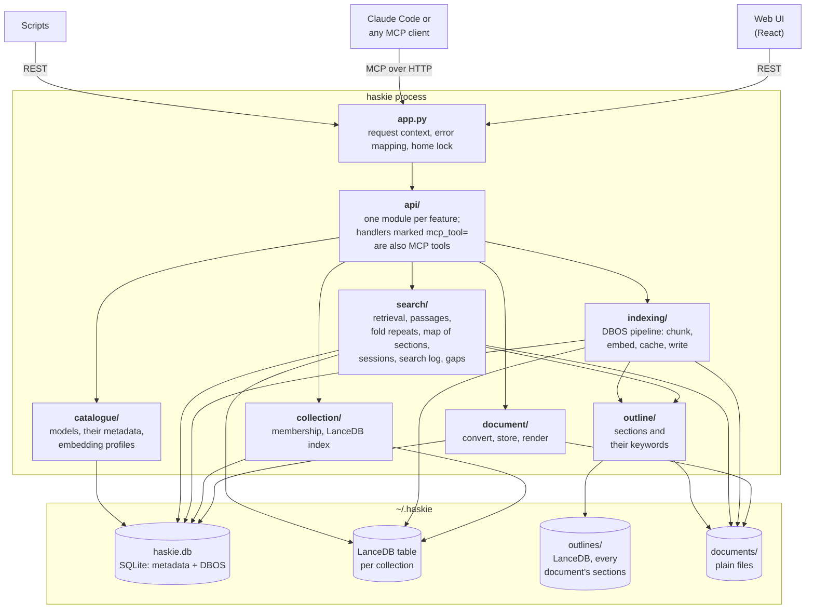

# Architecture

haskie is one Python process. It serves a web UI, a REST API and an MCP server from the same
Litestar app, and keeps everything under one home directory.



The code is packaged by feature. The HTTP layer is thin. Handlers parse the request, call the domain
and return `msgspec.Struct`s, or a file or stream for the document views. The domain raises typed
errors from `errors.py`, and `app.py` maps each one to its status code.

## Startup

```mermaid
sequenceDiagram
    participant CLI as haskie run
    participant Server as haskie run --foreground
    participant App as Litestar app
    participant Home as ~/.haskie
    participant DBOS
    CLI->>CLI: probe /api/status (already serving this home? done)
    CLI->>Server: spawn, detached; wait until it answers or exits
    Server->>Home: home_holder, then the schema version, read-only
    Note over Server,Home: refused here in one line, which the CLI shows from the log
    Server->>App: start on 127.0.0.1:8451 (default)
    App->>Home: claim_home (create folders, exclusive lock)
    Note over App,Home: any other ASGI server, or a race, stops here
    App->>DBOS: workflows.start
    DBOS->>Home: migrate (check schema version, WAL on a new file)
    DBOS->>DBOS: start queues, recover unfinished workflows
    CLI->>App: /api/status: this home, the web UI there, first run done?
    Note over CLI: a first run not done opens the browser on it
```

`haskie run` serves the web UI, the REST API and MCP from one background process, so the UI is up
whenever an agent can search. `--foreground` serves in the calling process instead, for a
supervisor or `--reload`. The server checks the lock before it starts, and the app takes it as its
first startup step, so any ASGI server that runs the app is held to it too. A home is one SQLite
file and one set of queues, and two servers would take each other's work.

## Where to read next

- [Documents and collections](documents-and-collections.md): the two core entities
- [Indexing](indexing.md): the durable pipeline
- [Search](search.md): from query to cited excerpts
- [Runtime](runtime.md): async IO, the CPU budget, two event loops
