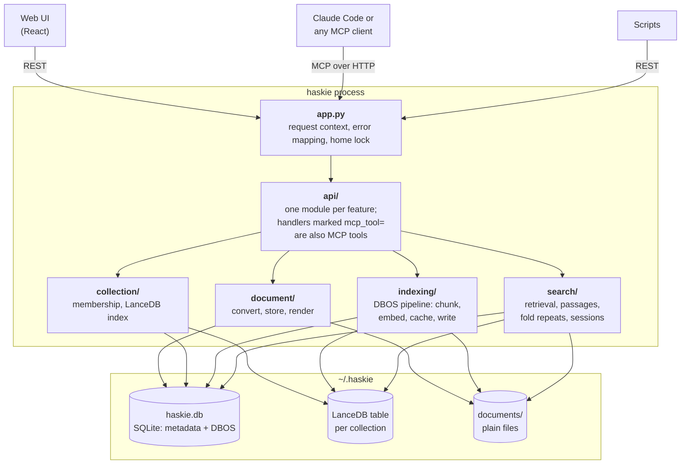
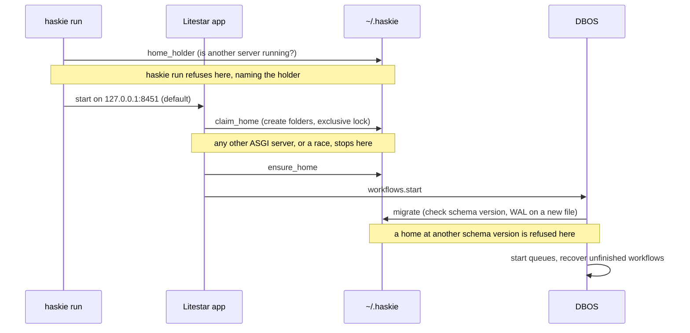

# Architecture

haskie is one Python process. It serves a web UI, a REST API and an MCP server from the same
Litestar app, and keeps everything under one home directory.

The code is packaged by feature. The HTTP layer is thin. Handlers parse the request, call the domain
and return `msgspec.Struct`s, or a file or stream for the document views. The domain raises typed
errors from `errors.py`, and `app.py` maps each one to its status code.

## Startup

`haskie run` checks the lock before it starts, and the app takes it as its first startup step, so
any ASGI server that runs the app is held to it too. A home is one SQLite file and one set of
queues, and two servers would take each other's work.

## Where to read next

- [Documents and collections](documents-and-collections.md): the two core entities
- [Indexing](indexing.md): the durable pipeline
- [Search](search.md): from query to cited excerpts
- [Runtime](runtime.md): async IO, the CPU budget, two event loops
