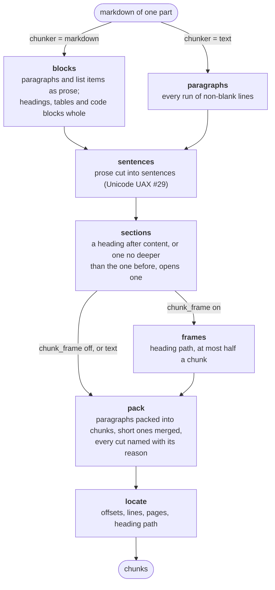
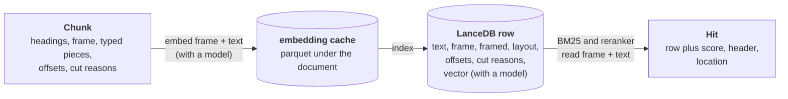
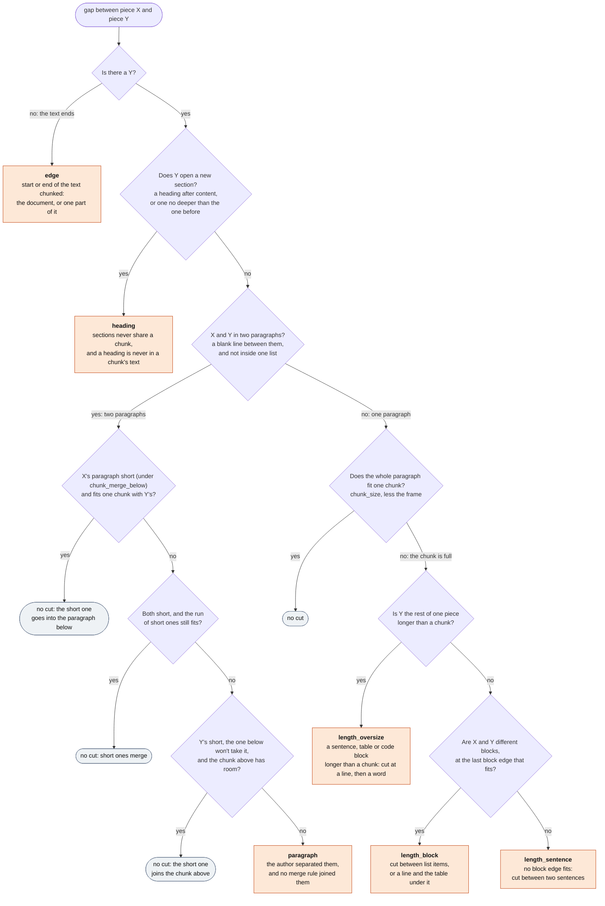

# Chunking

Structure-Aware Chunking cuts a document where its author did. A chunk never spans two sections.
It cuts at a blank line before it cuts inside a paragraph, and between sentences before it cuts
inside one. A table or code block stays whole unless it is longer than a chunk. Chunks never
overlap. The code is `src/haskie/indexing/chunk.py` (the steps) and `segment.py` (the pure folds
they call).

## Settings

Each applies to all collections, or to one as an override. Sizes are in characters.

| setting | default | what it does |
| --- | --- | --- |
| `chunker` | `markdown` | `markdown` reads headings, lists, tables and code. `text` splits on blank lines and sentences only |
| `chunk_size` | 1200 | the most one chunk holds. With a frame, the frame counts toward it |
| `chunk_merge_below` | 66 | a paragraph under this percentage of `chunk_size` joins a neighbour, when the two fit one chunk |
| `chunk_frame` | on | `markdown` only: the embedding, the reranker and the full-text index read each chunk with its heading path in front |

## Steps

`chunk.pipeline(settings)` builds the steps. Each hands its output to the next. Chunking runs once
per part: the whole document, or `batch_pages` pages of a PDF.

## Where a chunk goes

The embedding, the reranker and the full-text index all read the frame and the text together
(the `framed` column). So a heading's words find every chunk under it, and a heading never needs a
chunk of its own. Without an embedding model, chunks are cached and indexed without vectors.

## Gaps and cuts

The pieces of a text tile it. A piece is a sentence, or a block kept whole: a heading, a table, a
code block. Every gap between two neighbouring pieces is walked. **X** is the last piece before
the gap, and **Y** is the first after it. A gap either stays inside one chunk or becomes a cut,
and the step that makes a cut names its reason. A chunk's `end_reason` is the reason of the cut
after it, and its `start_reason` is the reason of the cut before it. So a chunk's start reason
always equals the previous chunk's end reason.

Where each reason comes from:

- `chunk.pack` ends every section but the last at `heading`, and the last at `edge`.
- `segment.sentences` numbers each piece's paragraph. `segment.pack` ends a group of paragraphs
  that `_merge` did not join at `paragraph`.
- `segment.fit` cuts a piece longer than a chunk. `_fill` and `_cut` name the `length_*` cuts.

| reason | where the cut is | as `start_reason`, the chunk after | as `end_reason`, the chunk before |
|---|---|---|---|
| `edge` | the start or end of the text | the first chunk of the document or of a part | the last chunk |
| `heading` | before a heading | it opens with its heading path | its section ends here |
| `paragraph` | at a blank line | it starts a new paragraph | a paragraph ended here |
| `length_block` | between two blocks of one paragraph | it begins at a block | it ends on a whole block |
| `length_sentence` | between two sentences of one block | it begins at a sentence | it ends on a whole sentence |
| `length_oversize` | inside a piece longer than a chunk | it continues a piece cut in two | it ends mid-piece |

A part is one convert output file: the whole document, or `batch_pages` pages of a PDF. Each part
is chunked on its own, so no chunk spans two parts. The headings still open at the end of one
part carry over to the next (`chunk.open_headings`).

## Sizes

A chunk's length is its span in the source, without the whitespace after it. With the
`frames` step, the frame counts too. Every chunk of a section gets `chunk_size` less the
length of its frame: the heading path joined with ` > `, plus a blank line. So a deep path means
smaller chunks. `chunk_merge_below` is a percentage of the whole `chunk_size`, whatever the frame.
A paragraph shorter than that is short.

## Paragraphs

Only a blank line separates two paragraphs, whatever the markdown inside them. A line that leads
straight into a table is one paragraph with the table. A whole list is one paragraph, with or
without blank lines between its items. Every paragraph is a chunk of its own, apart from the
merges the tree shows. Only a paragraph longer than a chunk is cut: between its blocks where one
fits, else between sentences. Sentences follow the Unicode sentence rules (UAX #29), so no
language setting is needed.

## Page markers

Page markers (`<!-- page 3 -->`, which the converter writes) are metadata. Every step reads one as
whitespace. So a marker never decides a gap, and no piece or chunk starts or ends on one. Inside a
chunk, `convert.without_markers` takes it out of the text. The text that is embedded, indexed and
shown has no markers, and a blank line around a marker stays one blank line. The chunk's offsets
still cover the source, markers included. A marker's offset is what gives the chunk its `page_start`
and `page_end`.

## Headings

Headings are metadata too. A heading line over text is never in a chunk's text. The headings a
section opens with are its heading path, kept on every chunk of the section (`Chunk.headings`) to
cite it by. A section of headings alone makes no chunk: a chapter title right before the next one, a
part title, a document of titles. A heading says where a point is. In converted books, most such
sections are page headers, page numbers and chapter title pages read as headings: 318 of 8,318
chunks in one home of books, none worth returning. Their headings still open the path of the chunks
after them.

The optional `frames` step (`chunk_frame`, on by default) also makes the path the chunk's
frame. The models read every chunk of the section after it (`chunk.framed`). A path longer than
half a chunk drops its outermost headings until it fits in half. A last heading that is still too
long is cut (`chunk._shortened`). Without the step the frame is empty, and the text has the whole
size. The `text` chunker cuts no sections at headings and never frames. It still files each chunk
under its heading path for citing.

## Chunks that say nothing

A chunk made only of pieces without a word (a `---` rule, a stray symbol, a page marker alone)
is not kept (`chunk._worded`). A search would find it only through its heading path, and it would
tell a reader nothing. Its headings ride on to the next chunk, and the chunk before it takes its
end reason, so the reasons of neighbouring chunks still meet. A rule inside a chunk, between two
paragraphs that merged, stays: the pieces of a chunk tile its span of the text.

## No overlap

Chunks never overlap: every character of text is in at most one chunk. With the `markdown`
chunker, heading lines over text are in no chunk's text. Page markers and the whitespace between
two chunks are in no chunk's text either, though a marker inside a chunk's span still counts
toward its offsets. The context a neighbour's sentences would carry comes from the front of the
chunk instead. The models and the full-text index read every chunk after its heading path, for
example `Part II > Replication > Leaders` and then the text.

Context prepended to each chunk, before it is embedded and indexed for BM25, cuts retrieval
failures (1 - recall@20) by 35%. With contextual BM25 the cut is 49%, and with a reranker on top
67% [1]. There an LLM writes 50-100 tokens of context per chunk. Here the document's own heading
path is the context, so it costs no model call. The source leaves chunk size, boundaries and
overlap as tuning choices, and gives no figure for overlap.

## References

1. Anthropic. "Introducing Contextual Retrieval." September 2024.
   https://www.anthropic.com/news/contextual-retrieval
