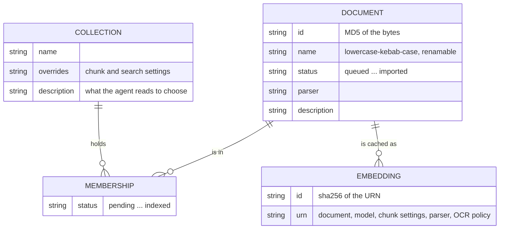
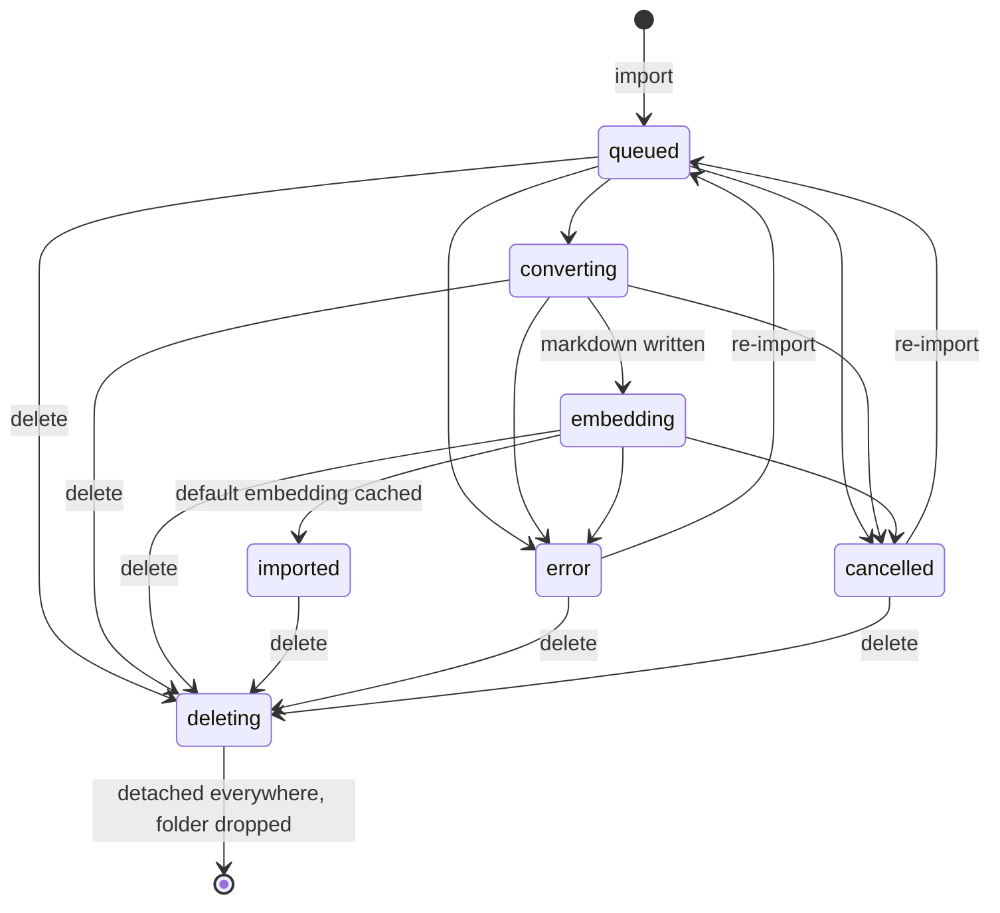
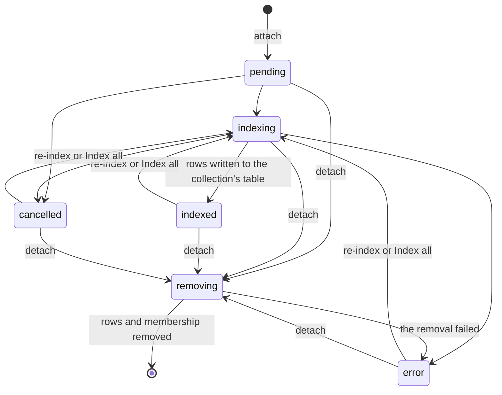
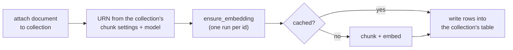

# Documents and collections

A document and a collection are separate things. A document is imported once and belongs to no
collection. A collection is a named set of documents with its own LanceDB table and its own chunk
and search settings. One document can sit in any number of collections.



A membership has no column pointing at an embedding. When a collection indexes a document, it
computes the cache id from its own chunk settings and reads that entry.

## A document's life

An upload from the UI lands in `staging/` first, as a file and a `staging` row, with no document
yet. The import then fixes the name, creates the document and moves the file into its folder. The
folder is named after the document's id, the MD5 of its bytes. A name is stored in
lowercase-kebab-case: accents dropped, the stem lowered, and every run of anything but a letter
or a digit turned into one dash, so `A_B--CC.d.f.pdf` is `a-b-cc-d-f.pdf`. The suffix is lowered
too. Each name has one spelling, so `Notes.md` and `notes .md` are the same name, and the second
is refused.

A rename (`PUT /api/documents/{name}/name`, or the Info tab) changes one column, `documents.name`.
Nothing else holds the name: the tables, folders, embedding cache and every collection's LanceDB
rows refer to the document by its id, and a search reads the names it cites from SQLite, one batched
query per read of the indexes. The original suffix stays. The search log and session history keep
the name as it was when they were written.

An agent's `add_document` imports a local path directly and copies the file. When it refuses the
path, the error names the file alone. The audit trail copies that error, and it never records the
folder an import came from. The nightly run (at 03:17, if haskie is running then) sweeps uploads
older than a day.



Any failure lands in `error`: a parser error, an OCR policy failure, or retries run out. A
re-import runs from `queued`, `error` or `cancelled`, with the `parser` and `skip_ocr_pages` the
document was imported with: to change either, delete it and import it again. A delete is accepted
in any state. The original suffix is kept in the name, because it decides the route:

- PDFs convert page by page with pdf-inspector. It judges a heading by its font. So a typeset
  book comes out with its chapters and sections at one level, and each page's running header
  ("348 Chapter 10 AGGREGATES") becomes a heading of its own. When the PDF has bookmarks of more
  than one level, they set the headings instead (`document/bookmarks.py`). pypdf reads them once,
  when the conversion is planned, and each batch gets them. A heading whose letters match a
  bookmark of its page, or of the page before, takes the bookmark's depth as its level. Every
  other heading becomes plain text. A bookmark matches once, so a running header matches none: it
  either adds its page number to the title, or repeats a title that a heading a page before
  already claimed. On one 657-page book, 232 of its 283 bookmarks matched, and its 748 sections
  became 251, nested as its table of contents is. Without such bookmarks, pdf-inspector's
  headings stand.
- Text and HTML files are read as they are.
- Images are stored and previewed, with no text to index.
- Everything else converts with anydoc, or is read as raw text when the document's `parser` is
  `plain`.

The import also warms the embedding cache for the default chunk settings. A re-import clears the
document's cached embeddings first.

## Repeats

The web UI stages several files at once, and checks each new file for repeats in its own row:

- **The same file.** Staging and a path import both take the MD5 of the bytes, which is the
  document's id. Staging answers with `duplicate`: the name of the document those bytes already are,
  or null. The row names it, and the import leaves that file out. An import of the same bytes is
  refused with 409, naming the document. A file the import refuses for another reason, such as a
  name already taken, stays in the list with the reason, so you can rename or remove it.
- **The nearest documents.** Writing a cache entry also stores the document as one vector: the
  mean of its unit chunk vectors. `GET /api/documents/{name}/similar` names the three nearest by
  cosine, under the current embedding model. The vector exists only once the import has embedded
  the document, so the UI follows the new file until then. A full-text-only profile has no
  vectors, so it finds no nearest documents.

## A membership's life

Attaching a document to a collection is an index operation with its own status, per collection.



Detaching deletes the document's rows from that collection's table. The request marks the
membership `removing`, cancels its index and queues the removal on the collection's single writer.
It answers at once: a compaction or another document's write may hold that writer for minutes.
`removing` counts as active, so the UI keeps polling until the membership is gone. Until then, the
old rows stay in the table, but a search leaves them out. The same holds for a document being
deleted, in every collection. Meanwhile an attach or a re-index of that document is refused, and
its index can no longer change the status. A removal that fails leaves the membership
in `error` with the reason, and detaching again retries it. Deleting a collection deletes its
table and memberships, and keeps every document. Deleting a document detaches it from every
collection first, then drops its folder and row.

Renaming a collection moves its row, its memberships, every session that chose it and its folder
in one transaction. The index table holds no collection name, so it moves as it is. A rename is
refused while any work of the collection runs: an index write or a maintenance run still holds
the old name, and would put the old folder back. A delete moves the folder aside before it
frees the name, so a create or a rename may take the name at once: the delete removes only the
folder it moved.

## The embedding cache

The cache makes one document cheap to share between collections. Each computed embedding is one
parquet file under the document, plus one `embeddings` row. The document's outline is built from
the first one under a model (`outline/build.py`, see [storage](storage.md#the-outline)). An
embedding's id is the SHA-256 of a one-line URN that names everything the rows depend on:

```
document_id:<id>;model:<model>;chunk_size:<n>;chunk_merge_below:<n>;chunk_frame:<b>;chunker:<c>;chunk_version:<v>;parser:<p>;skip_ocr_pages:<b>
```

`<model>` is `EmbeddingModel.cache_name`: the model's name and vector size, plus a hash of its
document prefix and Matryoshka recipe. Those are everything that shapes a stored vector, so a
change to any of them misses the cache and needs no `chunk_version` bump.

Same inputs give the same id, so the work runs once, until a re-import clears it. Two collections
that ask for the same missing entry at the same moment share one DBOS run. A collection with other
chunk settings gets its own entry. The accelerator, the query prefix and the duplicate
thresholds are not in the key: they shape no stored vector.



Code: `document/document.py`, `collection/collection.py`, `indexing/embed_cache.py`.
