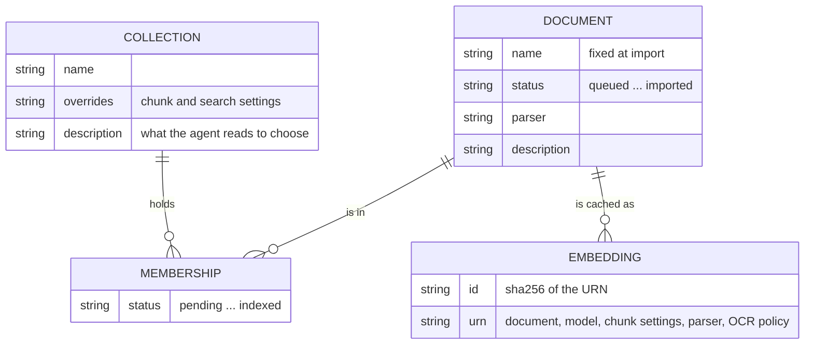
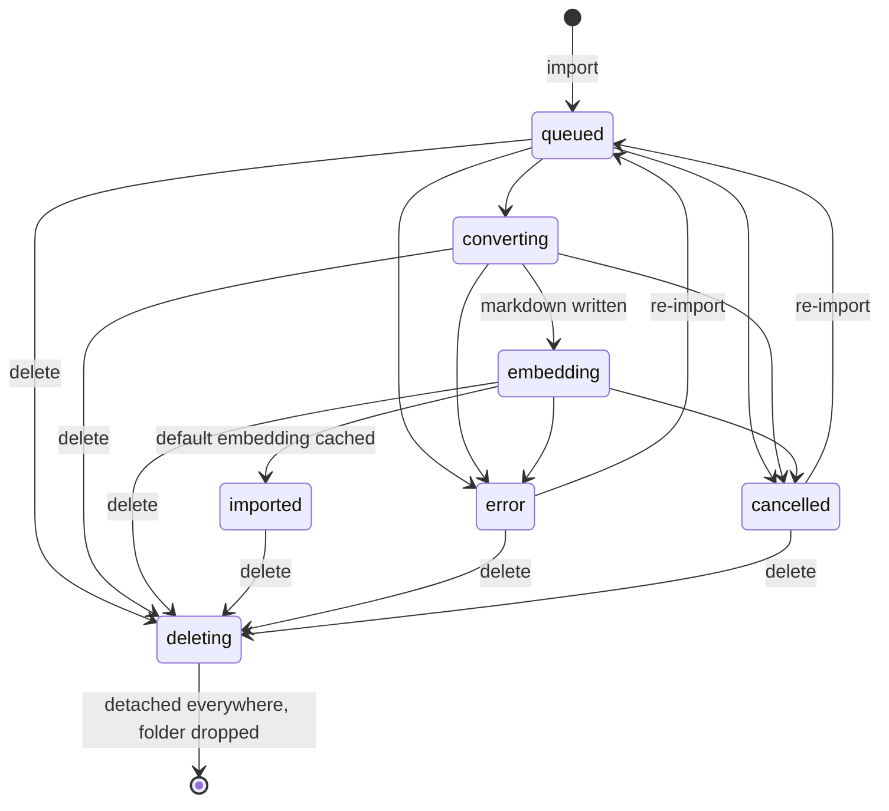
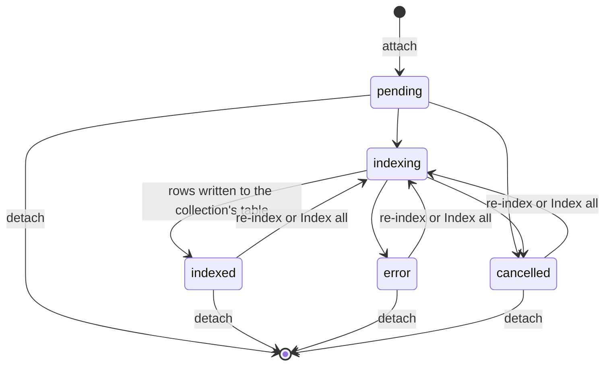
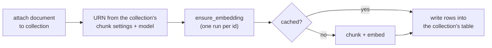

# Documents and collections

A document and a collection are separate things. A document is imported once and belongs to no
collection. A collection is a named set of documents with its own LanceDB table and its own chunk
and search settings. One document can sit in any number of collections.



A membership has no column pointing at an embedding. When a collection indexes a document, it
computes the cache id from its own chunk settings and reads that entry.

## A document's life

An upload from the UI lands in `staging/` first, as a file and a `staging` row, with no document
yet. The import then fixes the name, creates the document and moves the file into its folder. An
agent's `add_document` imports a local path directly and copies the file. The nightly run (at
03:17, if haskie is running then) sweeps uploads older than a day.



Any failure lands in `error`: a parser error, an OCR policy failure, or retries run out. A
re-import runs from `queued`, `error` or `cancelled`. A delete is accepted in any state. The
original suffix is kept in the name, because it decides the route:

- PDFs convert page by page with pdf-inspector.
- Text and HTML files are read as they are.
- Images are stored and previewed, with no text to index.
- Everything else converts with anydoc, or is read as raw text when the document's `parser` is
  `plain`.

The import also warms the embedding cache for the default chunk settings. A re-import clears the
document's cached embeddings first.

## A membership's life

Attaching a document to a collection is an index operation with its own status, per collection.



Detaching deletes the document's rows from that collection's table. Deleting a collection deletes
its table and memberships, and keeps every document. Deleting a document detaches it from every
collection first, then drops its folder and row. Memberships also go when their collection or
document is deleted.

## The embedding cache

The cache makes one document cheap to share between collections. Each computed embedding is one parquet file
under the document, plus one `embeddings` row. Its id is the SHA-256 of a URN, one line, that
names everything the rows depend on:

```
document:<name>;model:<model>;chunk_size:<n>;chunk_merge_below:<n>;chunk_frame:<b>;chunker:<c>;chunk_version:<v>;parser:<p>;skip_ocr_pages:<b>
```

`<model>` is `EmbeddingModel.cache_name`: the model's name and vector size, plus a hash of its
document prefix and Matryoshka recipe. Those are everything that shapes a stored vector, so a
change to any of them misses the cache and needs no `chunk_version` bump.

Same inputs give the same id, so the work runs once, until a re-import clears it. Two collections
that ask for the same missing entry at the same moment share one DBOS run. A collection with other
chunk settings gets its own entry. The accelerator, the query prefix and the duplicate
thresholds are not in the key: they shape no stored vector.



Code: `document/document.py`, `collection/collection.py`, `indexing/embed_cache.py`.
