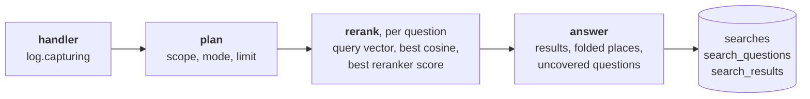

# Gaps

The Gaps page lists the questions your shelf did not answer, grouped by topic, with the searches
that asked them and what came closest. Replay asks them again after you add a document, so you
can see a gap close before you mark it resolved.

It reads the search log. Every search is written there, and nothing is judged when it is written.

## The search log

A handler opens a capture around the search (`log.capturing`). The search fills it in through a
context variable, so no step passes it along. Two places observe what they already hold:

- the flow's plan, or the full-text listing: the collections searched, the mode that ran, and
  the limit;
- the flow's `rerank` step, which every ranked search runs once per question: the question's
  query vector, the profile it was embedded under, the best cosine between the query and any row
  read, and the reranker's best score before its floor dropped any.

The best cosine is measured on the vectors, not read off a score column. A hybrid query's fusion
keeps only a rank score, and a rank says nothing about how close the best row came.

The capture is written when the search ends, in one transaction: a `searches` row, one
`search_questions` row per question asked, and one `search_results` row per place returned.
Places are stored in preorder with their parent, so the `also_in` trees survive; an excerpt's
places are its passages' repeats. Each keeps its citation (`header`, `location`), so the log reads
without the document. A failed search is written with its error, then the error goes on. A search
without a session is written too. A later page of `/api/search/text` is the same search and writes
nothing. A malformed question is a refused request, not a search, and writes nothing.

`GET /api/searches` reads the log back, newest first, and an agent reads it as the MCP tool
`list_searches`; neither ever sends a query vector. A session's history reads its searches from
the log. The Insights chart counts every search, a search without a session under "no session".
The nightly run deletes searches older than `retention.search_days` (90 by default; 0 keeps
everything).

## Which questions are gaps

`search/gaps.py` judges each stored question on read, so a bar measured again re-judges every
search already stored. A question is a gap when a detector fires:

| signal | when |
| --- | --- |
| `reported` | the agent that asked it said the excerpts do not answer it (`report_gap`), fully or in part. It reads the excerpts, so its verdict outranks every score |
| `empty` | its search returned nothing |
| `uncovered` | several questions were asked at once, and no excerpt answers this one |
| `weak` | its best match is under the bar. A reranked search is judged by the floor it dropped chunks under: the settings' `min_rerank_score` when one is set, else the reranker's calibrated floor (`reranker_calibration`), because the reranker reads query and passage together. Otherwise the profile's `weak_match` cosine decides. No bar known: no verdict |

A failed search is an error, not a gap. A new signal is one `Signal` member and one detector
function.

`report_gap` takes the session, the question as asked and a verdict, `insufficient` or `partial`,
with a note on what the excerpts lacked. It lands on the newest question with those words in that
session, within the last hour, and only on a search that ran. Its wording follows the
sufficient-context test: could a careful reader answer from these excerpts alone?

Gap questions are grouped into topics by leader clustering, newest first, as `collapse` folds
results. Each joins the closest topic whose newest question it matches, so a chain of near matches
never merges two topics that do not match each other. Two questions match when both were embedded
under one profile with a `same_topic` bar and their query cosine clears it. Otherwise only the same
words match. Topics rank by how many times they were asked, then by the newest.

The page and an agent share the routes: `list_gaps`, `replay_gaps`, `review_gaps` and
`report_gap` are MCP tools too, so an agent that adds a document can check the gap closed and
resolve it.

Replay asks each question again on its own, as `search_excerpts` over every collection with the
context it had. Every collection, not the scope it had: the question is whether the shelf answers
it now, and the new document often sits in a new collection. Nothing is written to the log.
Dismiss and resolve set `search_questions.review` on every question of the topic, so one part of
a search of several stays open while another is dismissed; reopen clears it.

## The bars

The cosine bars live in the catalogue next to the duplicate cosines:
`embedding_profiles.weak_match` and `embedding_profiles.same_topic`. A reranked search uses the
floor it dropped chunks under, which the log keeps when the settings override the reranker's. `catalogue/seed.sql` records how
each bar was measured. Each is set so that no answered question in the measurements is flagged.
A false gap costs the curator's trust; a missed one waits for the next search.

Two shelves were measured. Shelf A is a 1,776-chunk book with 40 questions it answers and 30 it
does not. Shelf B is four of haskie's own docs with 10 answered and 5 unanswered.

| model | answered, lowest | unanswered, highest | bar |
| --- | --- | --- | --- |
| compact (bge-small), cosine | 0.748 (A), 0.723 (B) | 0.733 (A) | 0.70 |
| arctic-m, cosine (A only) | 0.455 | 0.415 | 0.40 |
| ms-marco-MiniLM-L-6, reranker logit | 2.44 (A), 2.73 (B) | −2.22 (A), −4.91 (B) | floor 0.05 (logit −2.94) |

The cosine alone overlaps across shelves: an answered question on B scored under an unanswered
one on A. The bar sits under both and misses 5 of A's 30 gaps. The reranker separates the two by
at least 4.6 logits on both shelves, and its floor misses 1 of A's 30, so a search that reranks
gets the sharper verdict. A profile without a bar gives no cosine verdict; its questions can still
be `empty` or `uncovered`.

Code: `search/log.py`, `search/gaps.py`, `api/gaps.py`, `catalogue/seed.sql`,
`web/src/pages/Gaps.tsx`.
