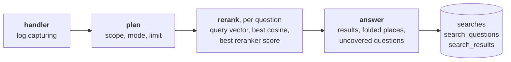

# Gaps

The Gaps page lists the questions your shelf did not answer, grouped by topic, with the searches
that asked them and what came closest. Replay asks them again after you add a document, so you
can see a gap close before you mark it resolved.

It reads the search log. Every search is written there, and nothing is judged when it is written.

## The search log

A handler opens a capture around the search (`log.capturing`). The search fills it in through a
context variable, so no step passes it along. Two places observe what they already hold:

- the flow's plan, or the full-text listing: the collections searched, the mode that ran, and
  the limit;
- the flow's `rerank` step, which every ranked search runs once per question: the question's
  query vector, the profile it was embedded under, and its score profile. That profile holds the
  20 best cosines between the query and the rows read (`log.similarities`), and the reranker's 20
  best scores before its floor dropped any. The best cosine and the best reranker score are the
  heads of those lists.

The best cosine is measured on the vectors, not read off a score column. A hybrid query's fusion
keeps only a rank score, and a rank says nothing about how close the best row came.

The capture is written when the search ends, in one transaction: a `searches` row, one
`search_questions` row per question asked, and one `search_results` row per place returned.
An excerpts search also keeps `missing_terms`, the words of its questions no excerpt held.
Places are stored in preorder with their parent, so the `also_in` trees survive; an excerpt's
places are its passages' repeats. Each keeps its citation (`header`, `location`), so the log reads
without the document. A failed search is written with its error, then the error goes on. A search
without a session is written too. A later page of `/api/search/text` is the same search and writes
nothing. A malformed question is a refused request, not a search, and writes nothing.

`GET /api/searches` reads the log back, newest first, and an agent reads it as the MCP tool
`list_searches`; neither ever sends a query vector. A session's history reads its searches from
the log. The Insights chart counts every search, a search without a session under "no session".
The nightly run deletes searches older than `retention.search_days` (90 by default; 0 keeps
everything).

## Which questions are gaps

`search/gaps.py` judges each stored question on read, so a bar measured again re-judges every
search already stored. A question is a gap when a detector fires:

| signal | when |
| --- | --- |
| `reported` | the agent that asked it said the excerpts do not answer it (`report_gap`), fully or in part. It reads the excerpts, so its verdict outranks every score |
| `empty` | its search returned nothing |
| `uncovered` | several questions were asked at once, and no excerpt answers this one |
| `weak` | its best match is under the bar. A reranked search is judged by the floor it dropped chunks under: the settings' `min_rerank_score` when one is set, else the reranker's calibrated floor (`reranker_calibration`), because the reranker reads query and passage together. Otherwise the profile's `weak_match` cosine decides. No bar known: no verdict |

A failed search is an error, not a gap. A new signal is one `Signal` member and one detector
function.

`report_gap` takes the session, the question as asked and a verdict, `insufficient` or `partial`,
with a note on what the excerpts lacked. It lands on the newest question with those words in that
session, within the last hour, and only on a search that ran. Its wording follows the
sufficient-context test: could a careful reader answer from these excerpts alone?

Gap questions are grouped into topics by leader clustering, newest first, as `collapse` folds
results. Each joins the closest topic whose newest question it matches, so a chain of near matches
never merges two topics that do not match each other. Two questions match when both were embedded
under one profile with a `same_topic` bar and their query cosine clears it. Otherwise only the same
words match. Topics rank by how many times they were asked, then by the newest.

The page and an agent share the routes: `list_gaps`, `replay_gaps`, `review_gaps` and
`report_gap` are MCP tools too, so an agent that adds a document can check the gap closed and
resolve it.

Replay asks each question again on its own, as `search_excerpts` over every collection with the
context it had. Every collection, not the scope it had: the question is whether the shelf answers
it now, and the new document often sits in a new collection. Nothing is written to the log.
Dismiss and resolve set `search_questions.review` on every question of the topic, so one part of
a search of several stays open while another is dismissed; reopen clears it.

## The bars

The cosine bars live in the catalogue next to the duplicate cosines:
`embedding_profiles.weak_match`, `answered_match` and `same_topic`. A best cosine under
`weak_match` is `weak`; from it up to `answered_match`, `borderline`; over it, an answer. A
reranked search uses the floor it dropped chunks under instead, which the log keeps when the
settings override the reranker's, and has no band. `catalogue/seed.sql` records how each bar was
measured. Each is set so that no answered question is flagged: a false gap costs the curator's
trust, a missed one waits for the next search.

`mise run evaluate-gaps` measures them (`tests/gapeval/`). It chunks and embeds two shelves, each
read at a pinned commit: "The Rust Programming Language" (Apache-2.0 or MIT; 45 answered
questions, 40 unanswered, 30 of them near its topics) and four of haskie's docs (12 answered, 5
unanswered). For each question it takes the score profile a search would log, and scores every
predictor in its `FEATURES` by AUROC, the chance an answered question scores above an unanswered
one.

| model | answered, lowest | unanswered, highest | bars |
| --- | --- | --- | --- |
| compact (bge-small), best cosine | 0.751 (Rust), 0.673 (docs) | 0.763 (Rust), 0.700 (docs) | weak 0.67, borderline to 0.775 |
| arctic-m, best cosine | 0.386 (Rust), 0.278 (docs) | 0.464 | weak 0.27, no band |
| MiniLM-L-6, best reranker score | 0.939 (Rust), 0.091 (docs) | 0.984 | floor 0.05 |

What the measurements say:

- **The best cosine stays.** The mean of the top 5 (`mean5`) ranks answered over unanswered a
  little better (AUROC 0.999 against 0.998 on the Rust book, 1.000 against 0.983 on the docs).
  Under a bar that flags no answered question on either shelf, it catches 32 of 45 against 30 for
  compact, but 13 against 18 for arctic-m. The top-two gap and the spread barely separate (AUROC
  0.64 and 0.86).
- **A bar does not travel between shelves, or between versions of one.** The Rust book's lowest
  answered cosine would flag 3 of 12 answered docs questions. An edit to the docs alone moved
  their lowest answered cosine from 0.698 to 0.673. The bars sit under both shelves, each read at
  its pinned commit.
- **The band catches what the low bar misses.** For compact, 0.67 to 0.775 holds all 15 other
  unanswered questions and 5 of 57 answered. For arctic-m the scores overlap too far: no band
  holds the missed ones under 15% of answered, so it has none. The reranker's floor has no band
  either: holding its 9 missed questions would flag 26% of answered.
- **The reranker is the sharper judge** on the Rust book (AUROC 0.998, and its floor catches 36
  of 45), weaker on the small docs shelf (0.883).
- **Missing words do not tell a wording gap from a missing document.** The idea: a borderline
  question whose words no near miss holds (`missing_terms`) exists under other words. But every
  unanswered question has such words (45 of 45), so the rule would label 14 of 45 true content
  gaps "wording", and would catch only 12 of 20 questions asked in words the docs do not use
  (`reworded` in `tests/gapeval`). Not shipped.
- **Shared near misses do not group topics.** Joining two gap questions by a lower cosine plus
  shared near misses joined 94% of same-topic pairs on the Rust book, against 89% by cosine alone,
  but merged 3 to 13 pairs of different topics on the docs shelf: on a small shelf, every
  unanswerable question lands on the same few chunks. Only identical near misses merge nothing,
  and they add nothing. Not shipped.

A profile without `weak_match` gives no cosine verdict; its questions can still be `reported`,
`empty` or `uncovered`.

Because a bar does not travel, a home can measure its own. `mise run calibrate-gaps sample`
writes the questions its searches logged, each with its best cosine and near misses. A person
marks each one answered or not. Then `measure --profile NAME --write` sets the two bars by the
same rules: no answered question under the low bar, and a band only while it flags at most 15% of
answered ones. It needs 10 labelled questions of each kind.

Code: `search/log.py`, `search/gaps.py`, `api/gaps.py`, `catalogue/seed.sql`,
`web/src/pages/Gaps.tsx`.
