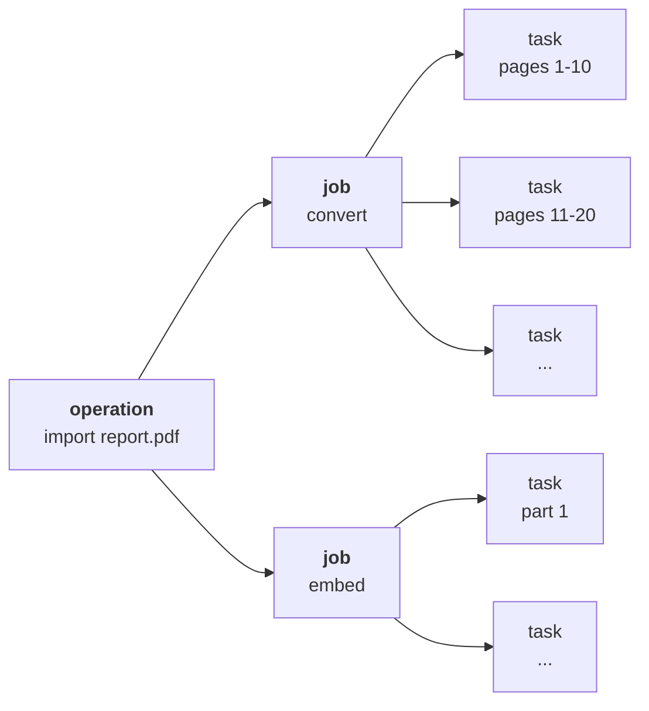
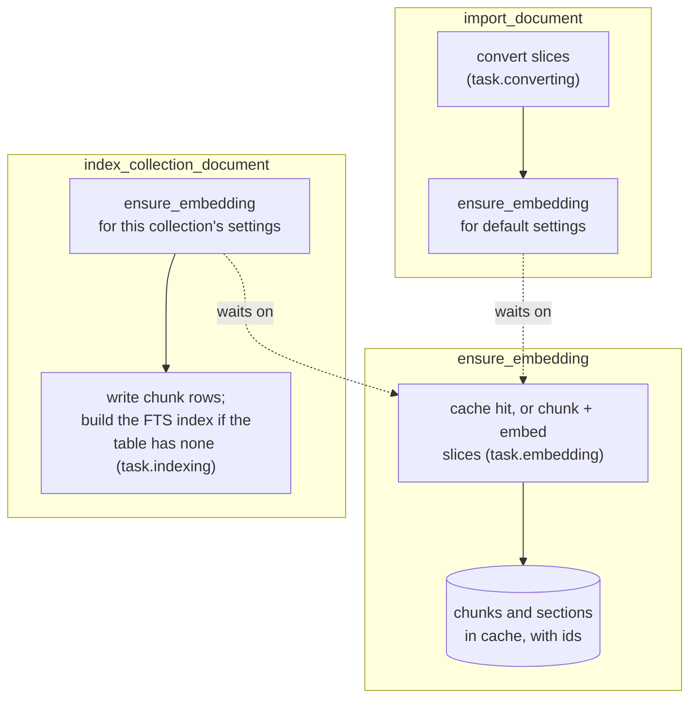
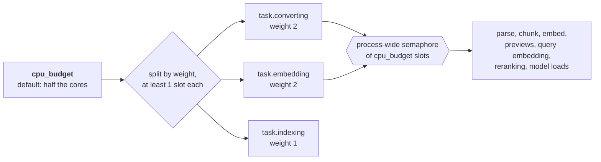

# Indexing

Indexing a shelf of books takes minutes to hours. Closing the laptop mid-run should cost the
current step, not the run. So imports, indexing, deletes, maintenance and model downloads run as
[DBOS](https://docs.dbos.dev) workflows, recorded step by step in the same SQLite file as the rest
of the app. Model warm-ups after boot are plain background tasks.

## Operations, jobs and tasks

haskie counts work in three words:

- An **operation** is what someone asked for: import a document, index it into a collection,
  delete a collection, download a model.
- A **job** is one stage of an operation: convert, embed or index.
- A **task** is one batch of a job, and one durable step.

"Workflow" is DBOS's word. The UI does not use it, though a few API names and DBOS error
messages still carry it.

## The three workflows

`ensure_embedding` always runs, and looks up the cache inside. On a hit it returns at once.

**Sections and ids.** The merge that publishes a computed embedding names every section of the
document and every chunk (`embed_cache._merge`, `sections/build.py`): a section is every heading's
run of chunks, cut by the same rule a search groups passages by, and each gets an id from its
document and its place among its sections, and a parent. Each chunk gets an id and the sections
that hold it ([Storage](storage.md#sections-and-their-ids)). Then `embed_cache.write` describes
the sections and writes them into their own file beside the chunks', before the entry's row: a
cache hit has both. Each cache entry, so each chunking, has its own sections and descriptors.

A descriptor strategy picks one to five words for each section that has any
(`descriptors.Strategy`). It reads prose only: code blocks and tables name identifiers and values,
not what a section is about. The only strategy, `ClassTfidf`, weighs the sections of one depth
against each other by c-TF-IDF, BERTopic's class-based TF-IDF with BM25 weighting: a chapter's words
against the other chapters'. Unlike BERTopic, it counts how many sections use a term rather than how
often the whole book does. A term more than half the sections of a depth use is the book's topic, so
it is no descriptor there: in one book on DDD, "model", "design" and "chapter" had been descriptors
of 31 sections, and are of none. The whole document's section keeps them. Nor is a term whose every
word the section's header already holds: "aggregates" under `Aggregates > Rule: Design Small
Aggregates` says nothing new. With an embedding model, each section's best 20 candidates are
embedded, one call for the whole document, and reranked against the section's vector (the mean
of its chunks' unit vectors, scaled to length one, never stored), as
BERTopic's `KeyBERTInspired` does. A word or word pair that a section uses once is left out, unless
the section is too short to have enough used twice. Most such terms are halves of a word a PDF split
over two lines, or two words that happen to meet. Measured once on one book (1.4 MB of markdown,
1,776 chunks, bge-small, on the dev machine): the descriptors took 2.4 s, the chunk embeddings 50 s.

**Batches.** Work is cut where the document's sections start (`indexing/parts.py`), so a section
is whole in one batch wherever it can be. Batches are packed greedily: a batch holds as many whole
sections as fit `batch_pages` pages (default 10), and is cut at the last section start inside
them. A section longer than that is cut at a page inside it, and a PDF without sections every
`batch_pages` pages, as before. Only a PDF has pages to cut at: other files have none.

- A PDF converts in batches cut at the pages its bookmarks start on, of any level. Without
  bookmarks, every `batch_pages` pages. Any other file converts as one batch.
- Embedding cuts the assembled markdown into parts where its headings start, and a section longer
  than a batch at its page markers (`pipeline.plan_embed`). Pages are counted by those markers, else
  as 3,000 characters each (`PAGE_CHARS`). Markdown without page markers is cut at headings alone:
  a section longer than a batch, or a file with no headings, is one part. The cuts depend on the
  markdown alone, so the document is
  chunked from the same parts under any chunk settings. On one 657-page book, 83 parts: 70 cut at a
  heading, 12 at a page inside a long section.
- Indexing writes `index_group_parts` parts per batch (default 50).

**Slices.** Convert and embed cut their batches into contiguous slices, at most
`document_parallelism` of them and never more than the stage's share of the CPU budget (0 means
that share). Each slice is one child workflow with one durable step per batch, so a large PDF
spreads over the free slots. The index stage is one child and is never sliced.

**One writer per table.** Every index child runs on `task.indexing`, partitioned by collection
with one slot per partition, and under a per-collection lock. So LanceDB sees one writer per
table. A detach's removal waits its turn there too. The request only queues it, and the
membership reads `removing` until it has run (see
[a membership's life](documents-and-collections.md#a-memberships-life)).

## Queues

| queue | concurrency | runs |
| --- | --- | --- |
| `operation.indexing` | twice `cpu_budget`, at most 64 | one import or index orchestrator per document |
| `operation.embedding` | same | `ensure_embedding`, one per cache id |
| `operation.collection` | 2 | index all, delete a collection, delete a document |
| `operation.downloads` | 2 | model downloads |
| `operation.maintenance` | 4 | maintenance orchestrators and nightly housekeeping |
| `task.converting` | its weight's share of `cpu_budget` | convert slices |
| `task.embedding` | its weight's share of `cpu_budget` | embed slices |
| `task.indexing` | its weight's share, one per collection | index writes, compaction and index builds, removals |

Most `operation.*` workflows orchestrate and wait on `task.*` children. Some do their own work:
model downloads, deletes and the nightly housekeeping.

## The CPU budget

The weights set the mix of queue slots, because the stages cost different things. Converting is
CPU and IO per page, embedding is model inference, and indexing writes to LanceDB. A slow stage
backs up on its own queue instead of taking every slot. The semaphore caps the CPU work itself.
Every piece of it holds one slot while it runs, including previews and the CPU part of a
search. Index writes and maintenance are IO and hold no slot. Lower the budget in Settings when
you need the machine back.

## Failure and recovery

- A **transient** failure (a busy database, for example) gets 3 attempts in total, with backoff.
- A **permanent** failure fails at once: a file the parser cannot read, or a PDF whose pages need
  OCR. With `skip_ocr_pages` on (the default), only a PDF where every page needs OCR fails.
  Unsupported file types are refused at import, before any operation starts.
- An embedding model that is still downloading or warming up is not a failure. The embedding
  run sleeps durably until the model is ready, before it cuts any slice. A batch that still finds
  it warming, after a restart for example, sleeps the same way. Only a model that failed to load
  ends the import in `error`.
- A slice that runs past `task_timeout_seconds` per batch is cancelled, not retried.
- A **model download** gets 5 attempts. Its durable id is `dl:{kind}:{model}`, so a restart
  reuses the files already on disk.
- On **restart**, DBOS resumes each workflow at its first unfinished step. It reads the
  recorded inputs back through `indexing/serializer.py`, which keeps each `msgspec.Struct` by
  field name. So a field added or removed since does not garble an old record. The DBOS application
  version is the package version, and DBOS runs only its own version's work. So at boot,
  `adopt_orphans` moves work recorded under another version onto this one and enqueues it again,
  each workflow on its own queue.
- **Deduplication:** one active import per document, one active index per membership, one
  embedding run per cache id. Two collections with the same chunk settings share one run. The
  run belongs to the operation that asked first. When a cancel of that operation also cancels
  the run, the other collection starts a run of its own.
- **Cancellation** works on running operations, from the Operations view or
  `DELETE /api/operations/{id}`. A cancelled import or index is marked `cancelled`.

The nightly run deletes operation history older than `retention.operation_days` (default 28).

Code: `indexing/workflows.py`, `indexing/pipeline.py`, `indexing/operations.py`,
`indexing/models.py`, `cpu.py`.
