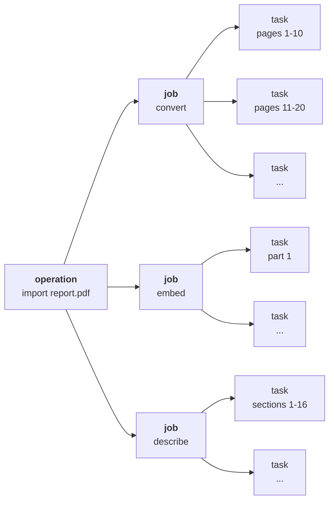
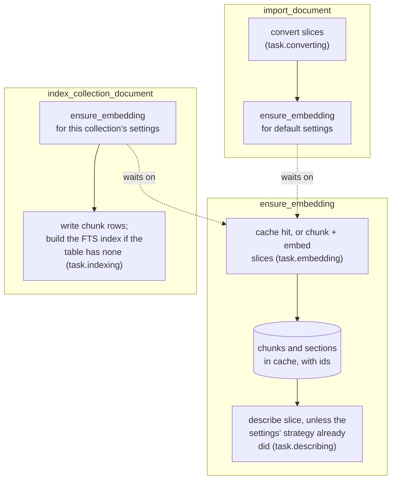
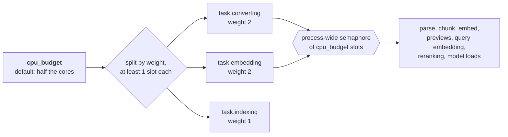

# Indexing

Indexing a shelf of books takes minutes to hours. Closing the laptop mid-run should cost the
current step, not the run. So imports, indexing, deletes, maintenance, model downloads, backups
and restores run as [DBOS](https://docs.dbos.dev) workflows, recorded step by step in the same
SQLite file as the rest of the app. Model warm-ups after boot are plain background tasks.

DBOS supplies durable execution without a separate job broker. Its
[Python project documentation](https://github.com/dbos-inc/dbos-transact-py) describes checkpointed
workflows and recovery. haskie chooses the step boundaries, cache keys and queue limits described
below; these determine how much work a restart repeats and which collections share an embedding.

## Operations, jobs and tasks

haskie counts work in three words:

- An **operation** is what someone asked for: import a document, index it into a collection,
  delete a collection, download a model.
- A **job** is one stage of an operation: convert, embed, describe or index.
- A **task** is one batch of a job, and one durable step.

"Workflow" is DBOS's word. The UI does not use it, though a few API names and DBOS error
messages still carry it.

## The three workflows

`ensure_embedding` always runs, and looks up the cache inside. On a hit it computes nothing, and
returns at once unless the sections were described by another strategy than the settings name.

**Sections and ids.** The merge that publishes a computed embedding names every section of the
document and every chunk (`embed_cache._merge`, `sections/build.py`). A section is every heading's
run of chunks, cut by the same rule a search groups passages by. Each section gets a parent and an
id from its document and its place among its sections. Each chunk gets an id and the sections
that hold it ([Storage](storage.md#sections-and-their-ids)). `embed_cache.write` writes the
sections into their own file beside the chunks', before the entry's row. So a cache hit has both.
Each cache entry, so each chunking, has its own sections and descriptors.

**Descriptors.** A stage of its own after the merge, `describe`, writes up to six descriptors
for each section that has prose, by the strategy the settings name (`pipeline.descriptors`). It
reads both files back, so describing again costs no embedding. It runs as one child workflow on
`task.describing` with a durable step per batch (`pipeline.describe_batch`), once the run has
waited for the model its strategy needs: sixteen sections a
batch for llm, which asks about one section at a time, and every section in one batch for
c-tf-idf, which weighs each section against the others. Each batch writes its descriptors to a
scratch file, and a last step puts them all on the sections file (`pipeline.finalize_describe`).
So the Operations view shows a Section descriptors job and how many of its batches are done, and a crash
repeats one batch, not the whole document. The sections file's metadata names the strategy that
wrote it. A cache hit whose strategy differs from
the settings' is described again, so *Index all* applies a changed setting to a whole collection.
Every strategy reads prose only: code blocks and tables name identifiers and values, not what a
section is about.

- **llm.** The selected describer, Qwen3.5-4B or Gemma-4-E2B, runs through llama.cpp on the
  Apple GPU. The models use roughly 2.8–3.0 GB; see [model loads](runtime.md#model-loads). It runs
  three stages in the same import or index operation: **Describe sections**, **Section
  descriptors**, then **Describe document**. The first writes one-to-two-sentence descriptions;
  the second writes up to six topics. They use separate prompts with reply budgets of 120
  and 90 tokens. Both read the section's heading path and up to 6,000 characters of its prose
  (`sections/generated.py`). A longer section is read as six chunks spread over its span.
  Both fields are saved in the sections cache. Each section stage checkpoints batches of
  sixteen sections and shows its own progress. Topics already named in the heading remain
  eligible descriptors in both strategies.
  The descriptor stage runs deepest sections first (`pipeline.describe_order`). A section with
  subsections and more than 48,000 characters of prose (eight excerpts) is described after them,
  from their outline beside its excerpt: each subsection's heading with the descriptors it got,
  at most 3,000 characters, deeper headings dropped first. A batch reads what the batches before
  it wrote, and each scratch file names its sections by id, so the last step puts every list back
  on its own section. Judged blind on 120 parent sections, the outline scored +0.52 over the
  excerpt alone above 48,000 characters (29 sections), and nothing below: +0.04 from 12,000 to
  24,000, and -0.10 [-0.33, +0.15] on 48 parents of 4 to 15 chunks. The bar was read off those
  same sections. Descriptors rolled up from the subsections without a prompt scored worse than
  the model's own: they name single subsections.
  Gemma-4-E2B's earlier five-descriptor prompt scored 4.04 of 5 on 200 sections of four technical books,
  against 2.13 for c-TF-IDF, at 0.51 s a section on an M4 Pro. Its model downloads like the others,
  as a `describer`, and each batch waits for it. The document stage uses the saved section
  descriptions and descriptors to write two to five sentences (`generated.summarize`). Long
  documents are summarized in groups of at most sixteen sections and 10,000 characters, then
  those summaries are combined until one remains. Every section with metadata contributes.
  Each sentence starts with a verb ("Explains how ..."), never with "This document is" or the
  book's title, and front and back matter are left out. The automatic document description
  completes within the original operation. A description someone wrote, before or meanwhile, is
  never replaced. *Describe with AI* in a document's Info tab asks for one on demand and replaces
  what is there (`POST /api/documents/{name}/description/generate`), from the newest cache entry
  llm described, else the newest. *Describe with AI* on a collection
  (`POST /api/collections/{name}/description/generate`, a `summarize_collection` operation on the
  same queue) first describes each member that has no description, one at a time, then writes
  three to seven sentences on the collection as a whole from its members' descriptions, and
  replaces its own. Each member it describes is one task of the operation's Describe job, and
  the collection the last, so Operations shows how far it got. A member with no cached embedding
  yet is left out. The model reads 10,000
  characters of descriptions at most, so in a large collection each is cut to an equal share.
  Each collection then keeps a vocabulary of its own, so one concept gets one name across its
  books ([The vocabulary](#the-vocabulary)).
- **c-tf-idf**, the default, runs everywhere. `ClassTfidf` weighs the sections of one depth against
  each other by c-TF-IDF, BERTopic's class-based TF-IDF with BM25 weighting: a chapter's words
  against the other chapters'. Unlike BERTopic, it counts how many sections use a term rather than
  how often the whole book does. A term more than half the sections of a depth use is the book's
  topic, so it is no descriptor there. In one book on Domain-Driven Design, "model", "design" and
  "chapter" had been descriptors of 31 sections, and are of none. The whole document's section keeps
  them. Heading terms remain eligible. With an embedding model, each
  section's best 20 candidates are embedded in one call for the whole document. They are reranked
  against the section's vector (the mean of its chunks' unit vectors, scaled to length one, never
  stored), as BERTopic's `KeyBERTInspired` does. Each descriptor is a word or a word pair. One a
  section uses once is left out, unless the section is too short to have enough used twice. Most
  such terms are halves of a word a PDF split over two lines, or two words that happen to meet.
  Measured once on one book (1.4 MB of markdown, 1,776 chunks, bge-small, on the dev machine): the
  descriptors took 2.4 s, the chunk embeddings 50 s. In technical books it often picks code
  identifiers and names, which the judge scored low.

### The vocabulary

The describer reads one section at a time, so one concept comes back in several forms:
"Event-driven architecture" and "event-driven architectures", "architecture trade-offs" and
"architectural trade-offs", "performance enhancement" and "performance improvement". Across 26
books, 33,270 descriptors held 23,122 distinct forms, 87% of them used once. Under llm, each
collection therefore keeps a controlled vocabulary, as a thesaurus does: one preferred term per
concept, and every variant pointing at it (`sections/vocabulary.py`). A search of the collection
shows each section's descriptors in its preferred terms. The cache entries keep what the
describer wrote, since every collection that chunks a document alike shares them.

A `build_vocabulary` operation on `operation.vocabulary`, one at a time, rebuilds it. A document
indexed into the collection or taken out of it asks for one, debounced by
`maintenance_idle_seconds` like maintenance, so a burst of documents makes one run. The
Operations view lists it under Maintenance, as "<collection> vocabulary".

1. **Collect.** Every descriptor of the indexed members' sections, with the section it describes.
   Its variant is its lowercase form.
2. **Embed.** Each variant no earlier run embedded, by Qwen3-Embedding-0.6B (Qwen's Q8_0 GGUF,
   640 MB, on llama.cpp) with its similarity prompt ("Retrieve semantically similar text"), 1,024
   variants a step.
3. **Judge.** Each pair of the 32 nearest neighbours at a cosine of 0.93 or more whose words differ
   by more than their stems, and that no earlier run judged, is asked of the describer, in both
   orders: do the two name the same concept? Not if one is broader or narrower, related but
   distinct, or opposite. The pair is one concept when the mean of the two P(yes) is 0.15 or more.
   32 pairs a step, about 6 s.
4. **Cluster.** Variants in order of use, most used first. Each joins the nearest preferred term
   it is one concept with, or becomes one. Variants whose words are the same once hyphens and
   blanks go ("time-out", "timeout"), or the same word for word by stem ("system call", "system
   calls"), are one concept with no model asked. Unicode letters and meaningful punctuation
   remain distinct: "C++" and "C#" are not spelling variants. Empty normalized phrases never
   match automatically. The term is shown in the form the collection
   writes it in most often.

How each choice was measured, on 184 pairs labelled by hand (40 synonyms, 144 other concepts) and
74 antonym pairs:

- The collections' own granite-97m ranks antonyms above synonyms ("synchronous calls" and
  "asynchronous calls" at cosine 0.99), so no bar on its cosine separates them. Qwen3-0.6B with
  its similarity prompt ranks synonyms above other concepts at AUC 0.87, and above antonyms at
  0.96. Without the prompt it scored 0.76. Ten wordings of the prompt, Qwen3-4B (2,560
  dimensions), Harrier-0.6B, and centring or whitening the vectors did no better.
- A string distance merges different concepts at every bar that merges anything: "block
  ordering" into "lock ordering", "decoupling" into "coupling". Stems and separators merge none.
- Gemma asked "same concept?" alone said yes to 73% of other concepts and 96% of antonyms. Told
  what is not the same, it ranks at AUC 0.84. Combined with the cosine bar, 78% of synonyms merge,
  17% of other concepts (close neighbours such as "data validation" and "input validation"), and
  no antonym.

The first run of the largest collection measured, 12,754 variants, asks about 14,579 pairs: about
45 minutes at 93 ms a prompt on an M4 Pro. One of 1,113 variants asks about 640, in 2 minutes. A later run asks only about the pairs its new variants
make. The vocabulary lives in the collection's folder ([Storage](storage.md)).

**Batches.** Work is cut where the document's sections start (`indexing/parts.py`), so a section
is whole in one batch wherever it can be. Batches are packed greedily: a batch holds as many whole
sections as fit `batch_pages` pages (default 10), and is cut at the last section start inside
them. A section longer than that is cut at a page inside it, and a PDF without sections every
`batch_pages` pages. Only a PDF has pages to cut at.

- A PDF converts in batches cut at the pages its bookmarks start on, of any level. Without
  bookmarks, every `batch_pages` pages. Any other file converts as one batch.
- Embedding cuts the assembled markdown into parts where its headings start, and a section longer
  than a batch at its page markers (`pipeline.plan_embed`). A heading right behind a page marker is
  cut ahead of the marker. Each part carries the page open where it starts, so a part cut mid-page
  still knows its page. Pages are counted by those markers, else as 3,000 characters each
  (`PAGE_CHARS`). Markdown without page markers is cut at headings alone: a section longer than a
  batch, or a file with no headings, is one part. The cuts depend on the markdown alone, so the
  document is chunked from the same parts under any chunk settings. On one 657-page book, 83
  parts: 70 cut at a heading, 12 at a page inside a long section.
- Indexing writes `index_group_parts` parts per batch (default 50).

**Slices.** Convert and embed cut their batches into contiguous slices, at most
`document_parallelism` of them and never more than the stage's share of the CPU budget (0 means
that share). Each slice is one child workflow with one durable step per batch, so a large PDF
spreads over the free slots. The three description stages and the index stage are one child each and are never
sliced.

**One writer per table.** Every index child runs on `task.indexing`, partitioned by collection
with one slot per partition, and under a per-collection lock. So LanceDB sees one writer per
table. A detach's removal waits its turn there too. The request only queues it, and the
membership reads `removing` until it has run (see
[a membership's life](documents-and-collections.md#a-memberships-life)).

## Queues

| queue | concurrency | runs |
| --- | --- | --- |
| `operation.indexing` | twice `cpu_budget`, at most 64 | one import or index orchestrator per document |
| `operation.embedding` | same | `ensure_embedding`, one per cache id |
| `operation.collection` | 2 | index all, delete a collection, delete a document |
| `operation.describing` | 1 | document or collection descriptions requested with *Describe with AI* |
| `operation.downloads` | 2 | model downloads |
| `operation.maintenance` | 4 | maintenance orchestrators and nightly housekeeping |
| `operation.backup` | 1 | backups and restores (`backup.py`), never two at once |
| `task.converting` | its weight's share of `cpu_budget` | convert slices |
| `task.embedding` | its weight's share of `cpu_budget` | embed slices |
| `task.describing` | the embed weight's share of `cpu_budget` | describe slices, one per document. The llm describer answers one prompt at a time behind its own lock, in a thread that holds no CPU slot |
| `task.indexing` | its weight's share, one per collection | index writes, compaction and index builds, removals |

Most `operation.*` workflows orchestrate and wait on `task.*` children. Some do their own work:
model downloads, deletes, descriptions, backups and restores, and the nightly housekeeping.

## The CPU budget

The weights set the mix of queue slots, because the stages cost different things. Converting is
CPU and IO per page, embedding is model inference, and indexing writes to LanceDB. A slow stage
backs up on its own queue instead of taking every slot. The semaphore caps the CPU work itself.
Every piece of it holds one slot while it runs, including previews and the CPU part of a
search. Index writes and maintenance are IO and hold no slot. Lower the budget in Settings when
you need the machine back.

## Failure and recovery

- A **transient** failure (a busy database, for example) gets 3 attempts in total, with backoff.
- A **permanent** failure fails at once: a file the parser cannot read, or a PDF with pages that
  optical character recognition (OCR) reads no text on. With `skip_ocr_pages` on (the default),
  only a PDF with no text on any page fails. OCR reads nothing when the `ocr` setting is off, or
  when its model failed to download. While the model is still on its way, a PDF or image
  batch waits for it, durably and without a slot. Unsupported file types are refused at import, before any operation
  starts.
- An embedding model that is still downloading or warming up is not a failure. The embedding
  run sleeps durably until the model is ready, before it cuts any slice. A batch that still finds
  it warming, after a restart for example, sleeps the same way. Only a model that failed to load
  ends the import in `error`.
- A slice that runs past `task_timeout_seconds` per batch is cancelled, not retried.
- A **model download** gets 5 attempts. Its durable id is `dl:{kind}:{model}`, so a restart
  reuses the files already on disk.
- On **restart**, DBOS resumes each workflow at its first unfinished step. It reads the
  recorded inputs back through `indexing/serializer.py`, which keeps each `msgspec.Struct` by
  field name. So a field added or removed since does not garble an old record. The DBOS application
  version is the package version, and DBOS runs only its own version's work. So at boot,
  `adopt_orphans` moves work recorded under another version onto this one and enqueues it again,
  each workflow on its own queue.
- **Deduplication:** one active import per document, one active index per membership, one
  embedding run per cache id. Two collections with the same chunk settings share one run. The
  run belongs to the operation that asked first. When a cancel of that operation also cancels
  the run, the other collection starts a run of its own.
- **Cancellation** works on running operations, from the Operations view or
  `DELETE /api/operations/{id}`. A cancelled import or index is marked `cancelled`.

The nightly run deletes operation history older than `retention.operation_days` (default 28).

Code: `indexing/workflows.py`, `indexing/pipeline.py`, `indexing/operations.py`,
`indexing/models.py`, `cpu.py`.
