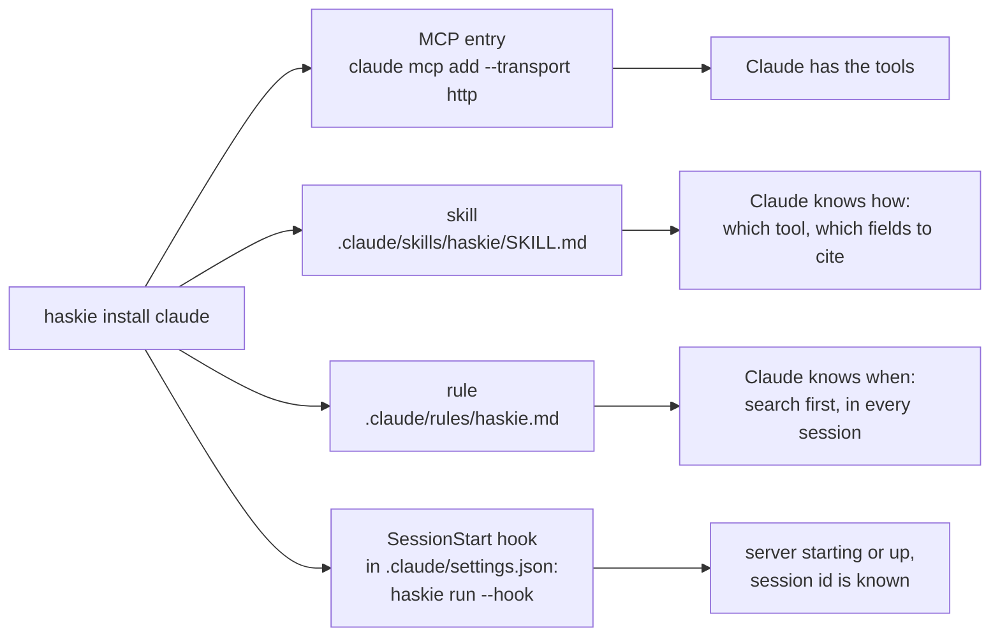

# MCP, Claude Code and Codex

haskie serves the Model Context Protocol (MCP) at `http://127.0.0.1:8451/mcp`, over HTTP. The tools
are the REST handlers marked `mcp_tool=`, so both surfaces share one contract, with one exception.
The two search tools (`search_excerpts`, `search_sections`) are twins of
their REST routes, under `/api/agent/` and left out of the OpenAPI document. Each runs the same
search and answers with fewer fields (`api/agent.py`): no offsets, chunk numbers, lines or pages
beside the `location` that names them, and no empty list or map. The web UI keeps the whole
answer. The skill that `haskie install claude` writes is the full tool reference for agents:
[`SKILL.md`](../src/haskie/claude_code/skills/haskie/SKILL.md).

## Tools

| group | tools |
| --- | --- |
| search | `search_excerpts`, `search_sections`, `set_session_collections` |
| catalogue | `list_collections`, `get_collection`, `list_collection_documents`, `list_documents`, `get_document` |
| write | `add_document`, `add_document_to_collection`, `remove_document_from_collection`, `describe_document` |
| log and gaps | `list_searches`, `list_gaps`, `replay_gaps`, `review_gaps`, `report_gap` ([Gaps](gaps.md)) |

Everything else stays in the web UI and the REST API: managing collections, re-indexing,
deleting or re-importing documents, operations and settings.

## What `haskie install claude` adds



The files go under `~/.claude` with `--scope user` (the default), or `./.claude` of the current
directory with `--scope project`. With `CLAUDE_CONFIG_DIR` set, the user scope follows it, as
Claude Code does. `--url` points them at another endpoint. The hook's full command is the
absolute path of `haskie` with `run --home <home> --host <host> --port <port> --hook`.
Re-installing replaces any haskie hook, including one in the older `ensure` form. The skill's
trigger and the rule both name the home's collections that hold an indexed document, so they fire
on the topics you collected. An empty collection is left out: every search of it answers nothing.
haskie records each directory it installed into (the `installations` table). Creating,
describing, renaming or deleting a collection, and any membership change, rewrites the skill and
rule there in the background, and so does every server start: that covers a change a crash lost and a template an upgrade
changed. A refresh skips an installation whose skill and rule are both gone, or whose
SessionStart hook another home's install took: the last install into a directory owns it. Only
uninstalling forgets one.

`haskie uninstall claude` (same `--scope`) removes all four: the MCP entry, the skill, the rule
and every haskie SessionStart hook in the settings file, leaving the user's own hooks and
settings. It forgets the installation first, so a running server does not write the files back.
Documents and collections stay.

Claude Code loads this unscoped rule at launch, independently of the hook. It needs no
`CLAUDE.md` reference to it; see [Claude Code rules](https://code.claude.com/docs/en/memory#organize-rules-with-clauderules).

## What `haskie install codex` adds

The Codex install has the same `--home`, `--url` and `--scope user|project` options. User scope
writes into `CODEX_HOME`, defaulting to `~/.codex`; project scope writes into `./.codex`.

| file under that directory | purpose |
| --- | --- |
| `config.toml` | `[mcp_servers.haskie]` with the HTTP endpoint and `[features] mcp_2026_07_28 = true` |
| `skills/haskie/SKILL.md` | the same collection-aware tool reference as Claude Code |
| `rules/haskie.md` | the same search-first rule, linked from Codex's instructions |
| `hooks.json` | a SessionStart hook running `haskie run --hook` |

The skill uses Codex's supported configuration-layer skill directory. This keeps custom
`CODEX_HOME` profiles separate. The installer edits TOML directly, so the Codex CLI need not
be on PATH. Other servers, settings, comments and hooks remain intact.

Codex defaults to the older MCP handshake. The installer enables its `mcp_2026_07_28` feature
so it sends the metadata haskie requires. Without it, the connection fails with
`Missing or invalid params._meta`. For an existing installation, run `haskie install codex`
again or `codex features enable mcp_2026_07_28`, then restart Codex. Uninstall leaves this
shared protocol feature enabled because other servers may use it.

Codex does not load prose from `rules/` itself. The installer prepends a managed block to
`AGENTS.md` that tells Codex to read the full rule at session start. User scope uses the file
under `CODEX_HOME`; project scope uses the file in the working directory, outside `.codex`.
If `AGENTS.override.md` takes precedence, the block goes there instead. Existing instructions
remain intact. Reinstall replaces only this block; uninstall removes it from both files.
See [Codex instruction discovery](https://learn.chatgpt.com/docs/agent-configuration/agents-md).

The SessionStart hook starts the server and supplies the session id. It does not repeat the
rule already linked from `AGENTS.md`. Older installed hooks with `--hook-rules` still work;
reinstall to replace them. Codex requires review and trust of each new or changed hook before
it runs. The instruction reference works even when the hook does not run, and supplies a
fallback session id policy. Project configuration also requires a trusted project.
Review the hook in Codex, then start a new session.
See the [Codex hooks documentation](https://learn.chatgpt.com/docs/hooks).

The installer starts haskie and waits for it, as the Claude installer does. Later hooks start
it without waiting. Run `haskie run` before the first session after a reboot to ensure the tools
are ready when Codex connects.

Collection changes refresh both Codex and Claude installations. An installation taken over by
another home or whose instruction files were removed is skipped. `haskie uninstall codex`
with the same scope removes haskie's entry, instructions and hook, and stops refreshing it.
Documents, collections and unrelated configuration remain intact. Schema 36 widens the
installation registry to accept Codex and preserves existing Claude installations on upgrade.

## A session, end to end

```mermaid
sequenceDiagram
    participant CC as Claude Code
    participant Hook as haskie run --hook
    participant H as haskie server
    CC->>Hook: SessionStart (JSON with session_id on stdin)
    Hook-->>CC: prints the session id announcement
    Hook->>H: probe 127.0.0.1:8451
    alt nothing serving
        Hook->>H: start haskie run --foreground, detached
        Hook-->>CC: prints "starting haskie on ..."
    else already serving
        Hook-->>CC: prints "haskie is already serving ..."
    end
    Note over CC: the rule says: search the collections first
    opt a broad question, unknown words, "which documents?", several authors
        CC->>H: search_sections(q, session_id)
        H-->>CC: sections with ids and descriptors, related sections, documents, cover, searched
        CC->>CC: read the map: its words, related headers; skip back matter
    end
    CC->>H: search_excerpts(q in the sources' words, session_id, section_ids?)
    H-->>CC: excerpts with header, location, spans, uncovered, missing_terms, searched
    CC->>CC: judge the text, answer citing header and location
    opt the excerpts do not answer it
        CC->>H: report_gap(session_id, question, verdict, missing)
    end
```

The hook's output is the only way the conversation's id reaches the tools, because no MCP call
carries it. With the id, the Sessions view shows the conversation's last 100 events: searches,
imports, attaches, detaches, descriptions and collection choices. Each operation it started
names the conversation as its origin. Every search is also written to the search log, with or
without an id, and the Gaps page reads it ([Gaps](gaps.md)).

The hook does not wait for the server, and Claude Code connects to MCP while the hook still runs.
So a session that starts while nothing is serving, such as the first one after a reboot, has no
haskie tools. Sessions that start once the server is up do. `haskie install claude` itself waits
for the server, so the session right after installing has them. After a reboot, run `haskie run`
before the first session if that session matters.

## How an agent should search

The rule and the skill teach this; the reasons come from a simulated agent run on haskie 0.19.0 (10
books, three collections, an `mxbai-rerank-xsmall` reranker) and from the retrieval research the
search follows. The map numbers predate two changes measured on the same shelf
([Search](search.md#sections-a-map-of-the-shelf)): the merge across collections cut its off-domain
picks from 42 to 22 of 132, and a small reranker (MiniLM-L2) weighing the map from 22 to 5.

| | `search_excerpts` | `search_sections` |
| --- | --- | --- |
| answers | what the sources say: sections, quoted | where a topic lives: sections and documents, no text |
| reach | deep: few sections, grown to read whole | wide: picked to cover the whole scan |
| reranker | the one set, which drops what it judges no answer | the same one, which weighs every chunk and drops none |
| use it when | the agent knows the sources' words | the question is broad, the words are unknown, or it needs several authors |

- **Map first when the words are missing.** A novice question on keeping data consistent across
  services found no excerpt naming sagas. The map's descriptors held "Saga Patterns" and
  "compensating transactions". Asked again in those words, the first excerpt was the table of the
  eight saga patterns.
- **Read `related` before choosing.** In that map the two best sections, on transactional and
  epic sagas, sat only in `related`, under another pick.
- **The map can drift.** With no reranker, every map on the 8-book shelf held an index or a bare
  "Summary", and 5 of 8 picks for "command vs event" were sections like "event loop". The map's
  reranker now weighs those down; back matter remains, so the agent judges each pick by its header
  and descriptors.
- **Excerpts lean on one author.** On event sourcing, 6 of 8 excerpts came from one book, and a
  whole book on the topic got 1. For several views the agent maps first and passes sections of
  several documents as `section_ids`.
- **Parts, not keywords.** A question with parts that may be answered in different places goes in
  as 2 to 5 parts that take turns at the slots. Conditions one passage must meet stay in one part.
  An ambiguous question is resolved first, or asked as one part per reading: in the studies the
  research follows, a language model's rewrites surfaced only the most popular reading.
- **Fewer excerpts read better.** Answer quality rises with the first passages and then falls as
  more are added, so `limit` defaults to 10 and the agent narrows with `section_ids` or
  `document_ids` rather than raise it.
- **Scores rank; they do not judge.** A question on the Linux scheduler, which no book covers,
  returned 5 to 6 confident excerpts on Python thread pools. Its best reranker score (0.174) was no
  lower than that of a part the sources did answer (0.171). Both searches now list in
  `uncovered` a question whose best match is under the measured bar, one alone included, but the
  bar catches only some misses. The agent reads the text and calls `report_gap` on a miss.
- **The answer names its scope.** After a session was narrowed to the Python collection, an
  event-sourcing question returned asyncio excerpts and nothing said why. Both searches now answer
  with `searched`.
- **An empty `also_in` is not disagreement.** It did not fire once in 74 excerpts: different
  authors rarely repeat each other's sentences.

## Why HTTP, not stdio

One server serves the web UI, the REST API and every MCP client at once. litestar-mcp speaks MCP
`2026-07-28`, which replaced `initialize` with `server/discover`. A stdio client cannot connect,
and an HTTP client that opens with an older `initialize` request is refused.

Code: `claude.py`, `cli.py` (`run`, `install claude`, `uninstall claude`),
`src/haskie/claude_code/`.
