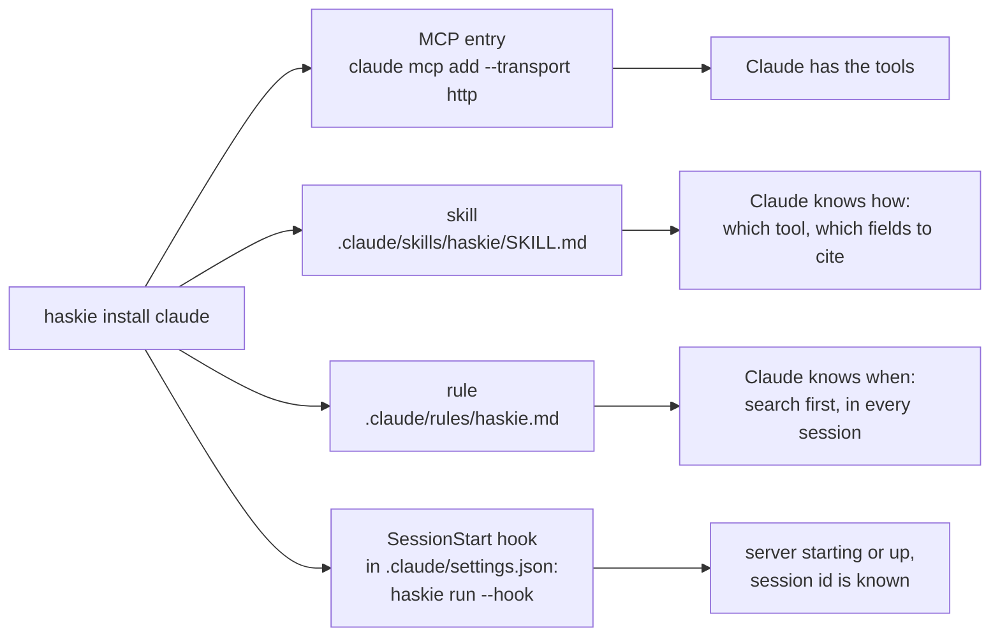
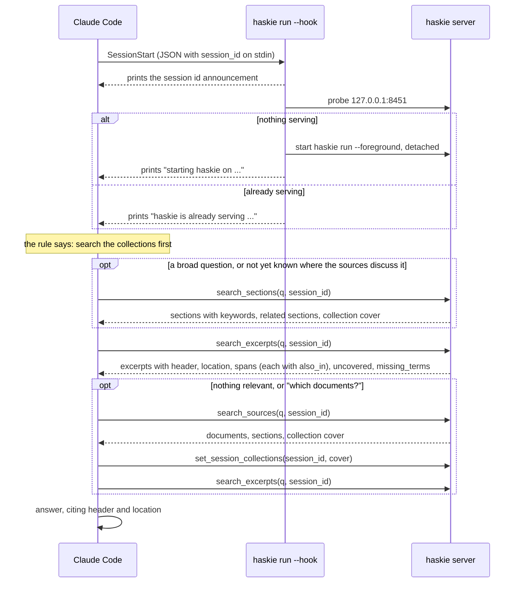

# MCP and Claude Code

haskie serves the Model Context Protocol (MCP) at `http://127.0.0.1:8451/mcp`, over HTTP. The tools
are the REST handlers marked `mcp_tool=`, so both surfaces share one contract. The skill that
`haskie install claude` writes is the full tool reference for agents:
[`SKILL.md`](../src/haskie/claude_code/skills/haskie/SKILL.md).

## Tools

| group | tools |
| --- | --- |
| search | `search_excerpts`, `search_sections`, `search_sources`, `set_session_collections` |
| catalogue | `list_collections`, `get_collection`, `list_collection_documents`, `list_documents`, `get_document`, `document_outline` |
| write | `add_document`, `add_document_to_collection`, `remove_document_from_collection`, `describe_document` |
| log and gaps | `list_searches`, `list_gaps`, `replay_gaps`, `review_gaps`, `report_gap` ([Gaps](gaps.md)) |

Everything else stays in the web UI and the REST API: managing collections, re-indexing,
deleting or re-importing documents, operations and settings.

## What `haskie install claude` adds

The files go under `~/.claude` with `--scope user` (the default), or `./.claude` of the current
directory with `--scope project`. With `CLAUDE_CONFIG_DIR` set, the user scope follows it, as
Claude Code does. `--url` points them at another endpoint. The hook's full command
is the absolute path of `haskie` with `run --home <home> --host <host> --port <port> --hook`.
Re-installing replaces any haskie hook, including one in the older `ensure` form. The skill's
trigger and the rule both name the home's collections, so they fire on the topics you collected.
haskie records each directory it installed into (the `installations` table). Creating,
describing, renaming or deleting a collection rewrites the skill and rule there in the background,
and so does every server start: that covers a change a crash lost and a template an upgrade
changed. A refresh skips an installation whose skill and rule are both gone, or whose
SessionStart hook another home's install took: the last install into a directory owns it. Only
uninstalling forgets one.

`haskie uninstall claude` (same `--scope`) removes all four: the MCP entry, the skill, the rule
and every haskie SessionStart hook in the settings file, leaving the user's own hooks and
settings. It forgets the installation first, so a running server does not write the files back.
Documents and collections stay.

## A session, end to end

The hook's output is the only way the conversation's id reaches the tools, because no MCP call
carries it. With the id, the Sessions view shows the conversation's last 100 events: searches,
imports, attaches, detaches, descriptions and collection choices. Each operation it started
names the conversation as its origin. Every search is also written to the search log, with or
without an id, and the Gaps page reads it ([Gaps](gaps.md)).

The hook does not wait for the server, and Claude Code connects to MCP while the hook still runs.
So a session that starts while nothing is serving, such as the first one after a reboot, has no
haskie tools. Sessions that start once the server is up do. `haskie install claude` itself waits
for the server, so the session right after installing has them. After a reboot, run `haskie run`
before the first session if that session matters.

## Why HTTP, not stdio

One server serves the web UI, the REST API and every MCP client at once. litestar-mcp speaks MCP
`2026-07-28`, which replaced `initialize` with `server/discover`. A stdio client cannot connect,
and an HTTP client that opens with an older `initialize` request is refused.

Code: `claude.py`, `cli.py` (`run`, `install claude`, `uninstall claude`),
`src/haskie/claude_code/`.
