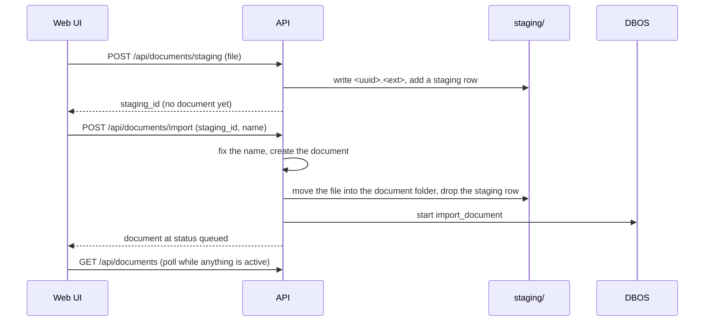

# REST API

The API is the contract for the web UI, for scripts and, through the same handlers, for the Model
Context Protocol (MCP). A running server serves its OpenAPI document at `/schema/openapi.json`.
`mise run schema` builds the same document from the app, with no server, and turns it into
`web/src/schema.d.ts`. `mise run check` fails when the two drift.

## Routes

Each feature has one module under `src/haskie/api/`.

| prefix | module | covers |
| --- | --- | --- |
| `/api/documents` | `documents.py` | two-phase intake (`staging`, then `import`), re-import, listing, one document, delete, its collections, embeddings, similar documents, sections, source, preview, cover, markdown and line views, description, `render` (a search result's markdown as HTML) |
| `/api/collections` | `collections.py` | listing, create, one collection, rename, delete, overrides, description, cover, members, attach, detach, re-index of the collection or of one member |
| `/api/search` | `search.py` | `excerpts`, `sections`, `explore` (chunk or passage) and `text` (BM25 only, no model); one collection is `collections=<name>`; all but `text` keep to `document_ids`, and `excerpts` and `explore` to `section_ids` |
| `/api/sessions`, `/api/insights`, `/api/searches` | `search.py` | session selection and history, searches and indexed chunks as raw points, the search log |
| `/api/gaps` | `gaps.py` | questions that found no answer, grouped by topic; review (dismiss, resolve, reopen); replay against the collections as they are now; an agent's report that a search did not answer it |
| `/api/operations`, `/api/jobs` | `operations.py` | history per kind, live activity, progress, a job's tasks, cancel |
| `/api/status`, `/api/init`, `/api/settings`, `/api/options` | `settings.py` | first-run init, user settings, and the option catalogue the UI builds its forms from |

A handler marked `mcp_tool="<name>"` is also an MCP tool. The search tools are separate handlers
under `/api/agent/`, left out of this document, that answer with fewer fields. See
[MCP and Claude Code](mcp.md).

## Two-phase intake

An agent skips staging: `add_document` imports a local file by absolute path.

## Who may call

Nothing authenticates a caller, and the server binds loopback. A browser ignores that bind, so
`app.guard_callers` checks two headers on every request:

- `Host` must name loopback or the address `run` bound. This stops a DNS-rebinding page. A bind to
  `0.0.0.0` exposes haskie on purpose, and the check is off.
- `Origin`, when present on a request that writes, must be haskie's own UI or listed in
  `HASKIE_ALLOWED_ORIGINS`. This stops any other page from posting to the API.

Agents, MCP clients and scripts send no `Origin`, so they pass the origin check. A refused request
answers `Forbidden`.

## Errors

Errors are part of the contract. Each type in `errors.py` carries its status code.

| error | status | when |
| --- | --- | --- |
| `HaskieError` | 400 | the base type, for example a home at another schema version |
| `Forbidden` | 403 | a host haskie does not serve, or a browser origin it does not trust (see above) |
| `NotFound` | 404 | no such collection, document or operation |
| `Conflict` | 409 | the state does not allow it: a name taken, the same file already imported, a document not imported yet, a home already initialized |
| `InvalidInput` | 422 | a bad argument |
| `ValidationException` (Litestar's) | 422 | a parameter or body that does not decode: a wrong type, a missing field, a value out of bounds |
| `PermanentError` | 422 | the file cannot be processed as it is |
| `NotReady` | 503, `Retry-After: 2` | a model is downloading or warming, or every preview builder is busy |
| `Unavailable` | 503 | a model failed to load; it stays failed until a restart or a settings save |

Each of these answers `{"detail": "<message>"}` and nothing else. Litestar documents a route that
validates its input with its own 400 `{status_code, detail, extra}` body. `app.RejectingOperation`
replaces that with the 422 `{detail}` haskie answers, so a client built from the OpenAPI document
reads a rejection right.

Messages are written for the user. `home.scrub` replaces the home and user directories in them,
so they do not leak those paths.

## Paging

Most listings use keyset paging. The opaque cursor carries the sort key of the last row, so a row
added between two pages never shifts the next one. Pass `next_cursor` back as `cursor`. It is null
on the last page. The cursor carries the sort and order it was built for, so a later page needs
neither. An omitted `sort` or `order` is read from the cursor. One passed that differs from the
cursor's answers 422. So does a cursor haskie did not issue: one that does not decode, or whose
key holds something other than a string or a number sqlite can store. Full-text search and the
operation history use an offset cursor instead: a BM25 query cannot filter by score, and DBOS
history pages by offset.

Code: `api/`, `errors.py`, `paging.py`.
