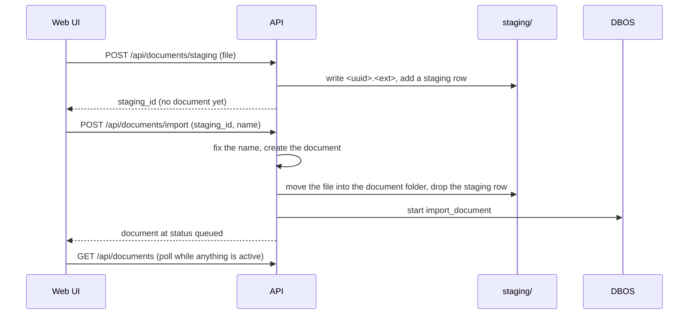

# REST API

The API is the contract for the web UI, for scripts and, through the same handlers, for MCP. A
running server serves its OpenAPI document at `/schema/openapi.json`. `mise run schema` builds the
same document from the app, with no server, and turns it into `web/src/schema.d.ts`.
`mise run check` fails when the two drift.

## Routes

Each feature has one module under `src/haskie/api/`.

| prefix | module | covers |
| --- | --- | --- |
| `/api/documents` | `documents.py` | two-phase intake (`staging`, then `import`), re-import, listing, one document, delete, its collections, embeddings and similar documents, source, preview, markdown and line views, description, `render` (a search result's markdown as HTML) |
| `/api/collections` | `collections.py` | listing, create, rename, delete, overrides, description, members, attach, detach, re-index |
| `/api/search` | `search.py` | `excerpts`, `sources`, `explore` (chunk or passage; one collection is `collections=<name>`), `text` (BM25 only, no model) |
| `/api/sessions`, `/api/insights` | `search.py` | session selection and history, searches and indexed chunks as raw points |
| `/api/operations`, `/api/jobs` | `operations.py` | history per kind, live activity, progress, a job's tasks, cancel |
| `/api/status`, `/api/init`, `/api/settings`, `/api/options` | `settings.py` | first-run init, user settings, and the option catalogue the UI builds its forms from |

A handler marked `mcp_tool="<name>"` is also an MCP tool. See [MCP and Claude Code](mcp.md).

## Two-phase intake

An agent skips staging: `add_document` imports a local file by absolute path.

## Errors

Errors are part of the contract. Each type in `errors.py` carries its status code.

| error | status | when |
| --- | --- | --- |
| `HaskieError` | 400 | the base type, for example a home at another schema version |
| `NotFound` | 404 | no such collection, document or operation |
| `Conflict` | 409 | the state does not allow it: a name taken, a document not imported yet, a home already initialized |
| `InvalidInput` | 422 | a bad argument |
| `PermanentError` | 422 | the file cannot be processed as it is |
| `NotReady` | 503, `Retry-After: 2` | a model is downloading, warming or failed to load, or every preview builder is busy |

Messages are written for the user. `home.scrub` replaces the home and user directories in them,
so they do not leak those paths.

## Paging

Most listings use keyset paging. The opaque cursor carries the sort key of the last row, so a row
added between two pages never shifts the next one. Pass `next_cursor` back as `cursor`. It is null
on the last page. Full-text search and the operation history use an offset cursor instead: a BM25
query cannot filter by score, and DBOS history pages by offset.

Code: `api/`, `errors.py`, `paging.py`.
