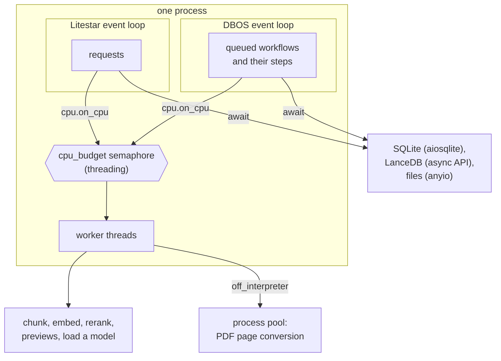

# Runtime

The UI stays responsive while the machine indexes. Two rules make that work: every IO is awaited,
and every piece of CPU work holds a slot of one budget.

- **IO is async.** Every handler is `async def`. SQLite goes through SQLAlchemy Core's async engine
  on `aiosqlite`, one connection per unit of work. LanceDB goes through its async API. Files go through `anyio`, with
  `os.replace` and `shutil.rmtree` in a worker thread because they have no async form.
- **CPU work is sync, in a thread.** `cpu.on_cpu` runs it in a worker thread and holds one slot of
  the `pipeline.cpu_budget` semaphore for as long as it runs. PDF page conversion goes one step
  further, to a process pool (`cpu.off_interpreter`), while the thread holds the slot. A pipeline
  step holds a slot for its CPU part only, never for the IO around it. The pool is pebble's: a
  parser that crashes its worker fails only its own call, and a new worker takes its place.
- **Two loops, nothing shared.** Litestar and DBOS each run an event loop. They share no
  loop-bound primitive, so the budget is a `threading` semaphore, each loop has its own thread
  limiter, and the search fan-out builds its semaphore per call.

## Where blocking IO remains

Sync IO runs in worker threads wherever a library has no async form. The main cases:

- `document/convert.py`: the parsers take a path and read it themselves.
- `home.atomic_write_sync`, `home.remove_tree`, and the move or copy of an imported original.
- `indexing/embed_cache.py`: pyarrow reads and writes parquet synchronously.
- Reading line windows of a document's markdown, for search and the line view.
- DBOS launch, destroy and garbage collection, through sync SQLAlchemy.
- `db._migrate_sync`: the schema script and the one-time WAL switch, before anything else opens
  the file.

## Model loads

ONNX Runtime holds the GIL while it builds a session. Every request waits for as long as the build
takes, which can be seconds. ONNX models run on CUDA with the `gpu` extra, else on the CPU. On
Apple Silicon the GPU is reached through MLX (`indexing/mlx_models.py`) and llama.cpp
(`indexing/gguf_models.py`, the `-gguf` profiles), which load a model in under a second and release
the GIL while they compute. llama.cpp's first load on a machine also compiles its Metal shaders,
once, in about 8 s. CoreML runs ONNX models only when the hardware setting says `coreml`.
It keeps compiled models under `cache/models`, so a model compiles once per home. Embedders and
rerankers follow the same hardware setting. `indexing/hardware.py` decides the device of each
model. A model with no device here, such as an MLX model without Apple Silicon, is refused by its
loader and left out of `/api/options`. Settings that would strand a model are rejected. Each model
in `/api/status` reports its device.

A downloaded model still has to load into the process. A boot that finds a finished download warms
it in a background task and reports it ready only after that. A search that needs a model still
downloading, warming or failed fails fast with a 503. While it downloads, the message names the
download operation.

## Shutdown

Every stage of a shutdown has a bound, and each stage past the first is harder than the last:

1. **Requests drain.** SIGTERM or Ctrl-C stops new connections. Requests in flight get 10 seconds.
2. **The pipeline stops.** DBOS gives running workflows 10 seconds, then cancels them. A second
   SIGINT or SIGTERM during those seconds ends the wait at once and logs `shutdown_hurried`.
   The extraction pool closes and kills its workers at once, even in the middle of a page. An
   extraction lost this way raises `ShuttingDown`, a `BaseException`, so DBOS records no error
   and the workflow stays pending for the next boot. A hurried stop keeps the home lock until
   the process exits, because DBOS is still running workflows.
3. **The interpreter exits.** Python waits for every non-daemon thread and ignores Ctrl-C while
   it waits. CPU work in a thread cannot be interrupted, so the app gives the exit 5 seconds.
   After that it exits anyway and logs `exit_forced` with the names of the threads it left.

One Ctrl-C can reach the server more than once. The terminal signals the whole process group,
and `mise run` and `uv run` each send the signal on again. So a signal within half a second of
the last one that counted is dropped as a copy. Only a real second press hurries a shutdown.

A second Ctrl-C while requests drain skips stage 2, and stage 3 then bounds the exit. `haskie stop`
sends SIGTERM, then SIGINT, then SIGKILL, each after a wait. Operations are durable, so a forced
stop costs a recovery at the next boot, not the work.

Code: `cpu.py`, `db.py`, `home.py`, `indexing/embed.py`, `indexing/models.py`, `shutdown.py`,
`cli.py`, `indexing/workflows.py`.
