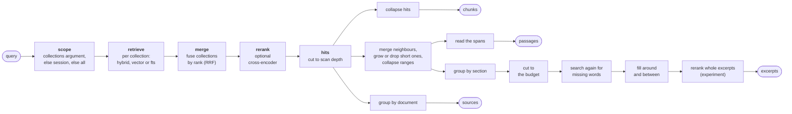

# Search

`search_excerpts`, `search_sources` and `GET /api/search/explore` share one ranking, then run the
fold their answer needs. `search/flow.py` builds these pipelines in one screen. A search of one
collection is the same search with `collections` set to it: the collection page asks `explore`
for passages. `/api/search/text` is the one search on its own path, a separate BM25 search that
neither merges collections nor folds repeats.

## The shared ranking

1. **Scope.** The `collections` argument, else the session's collections, else all of them.
2. **Retrieve.** Each collection runs `hybrid` (vector and BM25, fused), `vector` or `fts`.
   Fusion is `rrf` (reciprocal rank fusion) or `linear`. Without an embedding model everything is
   `fts`. The query is embedded once, and up to 8 collections are read in parallel. A collection
   still building its first full-text index has no BM25 half yet: `hybrid` answers with the
   vector half alone, and `fts` finds nothing there. A document on its way out of a collection
   answers from none of its rows there: a membership `removing`, or a document `deleting`. One
   query per search reads those names, and each read filters them out before its limit.
3. **Merge** across collections by rank, because scores from two indexes are not comparable. A
   chunk that two collections share counts once: the same span of one document, whatever `seq`
   each collection's chunk settings give it. A search over one collection keeps that
   collection's own scores.
4. **Rerank** (optional). A cross-encoder rescores the merged `candidates`.

The last of these steps to run sets a chunk's score. With a reranker on, it is the sigmoid of the
cross-encoder's logit, 0 to 1, so switching the mode only changes which `candidates` it reads: a
chunk found in both modes scores the same. The sigmoid is there because most logits are negative,
and a passage folds its chunks' scores (below): a negative one would subtract under `sum` and
zero the whole under `harmonic`. Without one, several collections
give a rank-fusion score, and one collection keeps its mode's own: BM25, `1 / (1 + squared L2
distance)`, or the fused score of `rrf` or `linear`. Passages, excerpts and documents then fold
chunk scores their own way.

Each step that sets or changes a score says how as it runs (`search/scoring.py`), the way each
step's time goes into `Server-Timing`. A search answers with that lineage, in pipeline order, in
its `X-Score-Lineage` header: JSON, percent-encoded, one `{step, label, rule}` per step. A step
that left the scores alone says nothing. The web UI shows it beside a result's score.

An excerpts search of several questions ranks each question at once, side by side. Each step of
those runs carries `branch=Q1`, `branch=Q2` and so on in `Server-Timing`, numbered in the order
the questions were asked; a shared step carries none. The web UI draws the branches as one block, and its server total adds the slowest branch
only, since they ran at the same time.

The ranking scans deeper than the answer. A folded repeat frees its slot for the next result,
several chunks go into one passage, several passages into one excerpt, and many chunks into one
source row.

## The four answers

| shape | what it is | who asks for it |
| --- | --- | --- |
| chunk (`Hit`) | one indexed chunk and its score | `explore?granularity=chunk`; also returned, without folding, by `/api/search/text` |
| passage | neighbouring matched chunks of one section, merged | `explore?granularity=passage` |
| excerpt | one section of a document, with every passage of it the search kept | `search_excerpts` (the Explore page too) |
| source | one document: score, best chunk, hottest sections, collections | `search_sources` |

A passage is the text its chunks cover, read by their offsets, with nothing added around it.
Chunks are cut at headings, blank lines, blocks and sentences (see [chunking](chunking.md)), so a
passage starts and ends where the author did. Each one carries its `header`
(heading path) and its `location` (`doc p.3-4 L10-20`) to cite.

## Excerpts: passages grouped by section

A search keeps passages one at a time, so three passages under one heading would come back as
three results competing for the slots. `search/section.py` groups them instead. An excerpt is one
section of one document, holding every passage the search kept in it, in document order. `limit`
counts excerpts, so the passages below the cut join the sections they belong to, and a section
that no kept passage opens takes no slot.

Which section: the largest one that still reads as a quote. A passage's heading path is tried
from the top. A level whose section holds the whole document (a title over everything) says
nothing, and a level whose section is longer than `max_section_chars` (12,000) is split one heading
down. So a book groups by chapter or by section, and a short note by its title. A passage under the
deepest heading it has takes that section, however long. The sections come from each document's
outline: every chunk's `seq`, heading path and char span, read in one LanceDB query per
collection. A chunk never spans two sections, so the outline is exact.

The excerpt's `text` joins its passages. Each passage opens with the headings it sits under that
the one before it did not, below the section's own `header`, as markdown headings of their depth.
`[…]` marks text between two passages that the search did not keep. `spans` lists the passages,
each with its own `header`, `location`, lines, offsets, score, `aspects` and `also_in`. The
excerpt's own offsets and lines run from the first passage to the last, and its `score` is the best
passage's.

## Words the answer never mentions

A search ranks by the whole question, so the part most of it is about can fill every slot while a
word the rest hangs on goes missing: "keep inventory consistent when an order is placed", answered
by five passages on orders and none on inventory. `search/probe.py` looks for each word of the
question (stopwords and words under three letters aside) in the kept sections' text and headings. A
text holds a word when one of its words has the same stem, by the Snowball English stemmer that
LanceDB's full-text index uses. So "keeps" holds "keep", "deployment" holds "deploy" and
"consistency" holds "consistent", while "category" does not hold "cat". The words none of them
holds are searched for once more by BM25 alone, and the best passage that search finds that no
section holds yet joins the answer. It joins the kept section it belongs to, or comes after the
others as one excerpt past `limit` and past the budget, which the sections were cut to before it.
Taking the last ranked section's slot instead would trade one gap for another, and a search of one
excerpt would lose its whole answer. With a reranker on, what the search finds is judged as the
ranked chunks are: scored against each question whose words are missing, dropped under
`min_rerank_score`, and tagged with the questions it clears. Without one, it is tagged with the
questions whose words it holds, and it scores 0, as the fill's chunks do: its BM25 score is on
another scale than the ranked passages', and would sort it above them.

`search_excerpts` answers with `excerpts`, `uncovered` (the questions no excerpt names, when
several were asked) and `missing_terms` (the words still missing after the probe). A synonym
defeats the probe: it asks only for the words the question used. Each search that probes logs
`search_probe` with the words, whether it found a passage, and whether that joined a kept section.
The Explore page shows the missing words and questions under the results.

## Filling around and between passages

The text between two kept passages, or just past them, often finishes the answer: the list under
"three rules:", the paragraph that explains a term. It did not rank, so `search/fill.py` weighs it.
Every chunk of the section within `max_passage_grow` (3) chunks of a kept passage is scored against
the question, by the query vector when every row has one, else by the question's words. Its value
is its score around the kept chunks' own: 0 for one as good as the median kept chunk, 1 for one as
good as the best, below 0 for a weaker one, clipped to [-1, 1]. With several questions a chunk
takes its best question's value. Without a reranker that question tags it; with one, only the
reranker's judgement tags (`aspects.tagged`), so a filled chunk brings no tag.

- A gap between two passages is filled when its values sum above 0, and the two become one. So a
  gap of up to twice `max_passage_grow` chunks can be filled. The joined passage scores by
  `score_fold` over the chunks of both.
- Every passage grows outward by the run of chunks next to it whose values sum highest, when that
  is above 0: into a gap as far as its half, so the passages on either side never reach for one
  chunk.

The same rule grows a short passage of the `passages` answer (next section), so a search has one
way of growing a passage, one scale of value and one setting for how far. A passage grows once:
an excerpts search only judges its short passages before the slots are counted, and the fill
grows every passage, short ones included.

This is the arithmetic of Relevant Segment Extraction [3]: a weak chunk comes in only when stronger
ones around it pay for it. Where a gap is not filled, `[…]` stays.

With a reranker on, `fill_values = absolute` (an experiment) values a chunk as dsRAG does instead:
the reranker scores it against every question, one pass a question, and its best score, spread
by the reranker's calibrated beta curve so its scores are about even over 0 to 1, less 0.18
(dsRAG's balanced preset) is its value. It needs no kept chunks to compare with, and it trusts the
calibration: an uncalibrated reranker's curve is the identity. dsRAG also decays a chunk by its
rank; here every chunk was scored, so none is. It costs one reranker pass a question over the
chunks near every section, and short passages grow the same way.

`grow_bias` (0, from -1 to 1) says how eagerly passages grow. It is added to every value, however
the value was reached, before the values are summed (`fill.biased`). Above 0 a weaker chunk pays
its way, so passages grow further and more gaps fill. Below 0 only a stronger chunk does. At -1
even a chunk as good as the best is worth 0, so nothing grows. Under `fill_values = absolute` the
bias moves dsRAG's penalty: 0.1 makes it 0.08. The same bias applies to short passages.

`max_answer_chars` (36,000) bounds what one excerpts search returns. Right after grouping, a
`budget` step cuts the sections to it, the last first, though the first section always stays
(`search_budget` logs how many went). The fills then go in, worth most per character first, while
they fit the room left. By default the fill does not ask the reranker even when one is on: scoring
every chunk near every section against every question would take seconds. Each search logs
`search_fill` with the signal and what it added.

## Short passages

A passage under `min_passage_chars` (300), or under 7 words, is thin: a section's lead-in ("Three
rules:", with the list in the next chunk), or a section's last line. For the `passages` answer,
`search/thin.py` grows it by the rule every excerpt's passages grow by: on each side, the run of up
to `max_passage_grow` (3) chunks whose values sum highest, when that is above 0. It never grows
past a heading. A neighbour's value is its score around the scanned hits' own: 0 for one as good as
the median, 1 for one as good as the best, scored by the reranker when one is on, else by the
cosine to the query vector, else by the share of the question's words it holds, then moved by
`grow_bias`. The floor is this search's own, so it needs no calibration per model. An excerpts
search only judges it here, whether a run worth taking is next to it, and leaves the growing to
the fill. Such a passage stands `owed` its growth. The fill values the same chunks against the
kept passages rather than the scanned hits, and may find none worth taking. An owed passage with
no run worth taking beside it is then alone after all (`thin.settle`), as a thin passage that took
nothing is below. One the fill found a run for keeps standing, even when the budget ran out. The
slot of a section dropped so is not handed on: the sections were counted before the fill.

A thin passage that took nothing is too short to stand alone. As a passage it is dropped, and its
slot goes to the next result. As part of an excerpt it stays when another passage of its section is
kept, and a section with no other passage is no excerpt. Two thin passages stay even when nothing
around them matches:

- the best result of the search, because a short exact answer is still an answer;
- a whole section, with a heading or the document's edge on both sides, such as a short note.
  Nothing of it is missing. Where one part of a PDF ends and the next begins (`part`, see
  [chunking](chunking.md)) is no such edge: the section goes on in the next part.

The neighbours are read only when a passage is thin, in one LanceDB query per collection. Each
search logs `search_thin` with the signal used and how many passages grew, stayed alone and were
dropped. With several questions, each question's passages are grown or dropped against that
question.

`search_sources` scores a document, and each of its sections, by folding the scores of the chunks it
matched (see "How chunk scores fold" below). It also returns a small set of collections that holds
every document listed, ready for `set_session_collections`. The set comes from the standard greedy
approximation of set cover, so it is small but not guaranteed smallest.

## How chunk scores fold

A passage, a document and a document's section each hold several matched chunks, and the
`score_fold` setting (`passage.fold`) turns their scores into one:

| rule | score | who scores this way |
|---|---|---|
| `sum` (default) | every matched chunk adds, so more matching text ranks higher | Vespa's chunk example: `sum(chunk_scores())` [4] |
| `max` | the best chunk alone | Elasticsearch `semantic_text`: "the most relevant passage will be used to compute a score" [5] |
| `harmonic` | harmonic(best, sum): between the best and twice it, so many weak chunks never outrank one strong one | haskie's own rule; no source measures it against the other two |

A chunk the search did not rank, one a passage grew into or the fill added, scores 0 and adds
nothing under any rule. An excerpt scores its best passage. The near-duplicate fold still measures
two results' overlap as the harmonic mean of its two directions, whatever `score_fold` is: that is
an overlap, not a score of matched chunks. Every search's score lineage names the rule it used.

### Reranking whole excerpts (experiment)

Folding chunk scores judges an excerpt by its parts, never by the text an agent reads. Recent
long-document rerankers score the unit they return instead: SumRank ranks condensed documents
[7], and EBCAR scores passages with their context [8]. With `rerank_excerpts` on and a reranker
chosen, an excerpts search scores each finished excerpt, its heading path in front, against the
questions it answers, one reranker pass a question, and the best of them is its score. A single
question's excerpts are then sorted by it; several keep the order their turns gave them.

It runs only when every excerpt fits what the reranker reads, estimated at four characters a
token: the catalogue's context for an ONNX reranker (jina-v1-turbo and ettin read 8,192 tokens),
512 for the MLX ones, whose loader cuts there, and 512 for MiniLM. An excerpt cut short would be
scored on its opening alone, beside others scored whole, so if one does not fit the chunk scores
stand. Each search logs `search_rerank_excerpts` with whether it ran and how long it took. It is
off until an evaluation shows it returns more answer per character than the fold.

## Folding repeats

A pointwise reranker scores one passage at a time, so it cannot see that two results repeat each
other [1]. `search/collapse.py` folds them in the chunk and passage pipelines, once per search, as
the last fold before the answer. `search_sources` groups by document instead. The fold walks the
results best first and compares each one only with the results already kept (leader clustering).
Comparing only with kept results stops chains, so A close to B and B close to C never merges A
with C.

Each new result is compared with each kept result in turn:

A duplicate is an exact character match once whitespace is collapsed, in any document. Both texts
need at least 7 words, so two equal headings do not fold. Equivalent means the same meaning in
other words: a nearly identical vector, or nearly the same words where words decide.

A new result that repeats no kept result takes a new slot, while fewer than `limit` are taken.
A passage too short to stand alone (see "Short passages") never leads a fold. Nothing folds under
it, and it never takes a fuller passage's slot. Its section is dropped when no other passage
stands in it, and a passage under it would be dropped too.

The containment and alike tests run in up to two spaces, and the first space that finds a repeat
decides. A `vector` search decides by the embedding space alone, as it ranks by vectors alone.
Hybrid and full-text searches use both:

- **Embedding space**, used when every result has a vector and the model has duplicate
  thresholds. Containment is the mean of each chunk's best cosine against the other result.
  Alike is the cosine of the two results' mean vectors.
- **Word space**, always used. Containment is the share of one result's three-word shingles found
  in the other (threshold 0.8). Alike is the Jaccard of their words (threshold 0.5, a common
  near-duplicate line [1]). A result with fewer than 5 shingles never matches here.

Cosine thresholds are set per embedding profile (`duplicate_chunk` and `duplicate_passage` in
`catalogue/seed.sql`), because a raw cosine means different things for different models. The
current values are placeholders, not calibrated, and the seed file names their sources. A profile
without thresholds folds by words alone. The containment threshold is a judgement call, and the
code says so.

A folded result becomes an `also_in` entry under the result it repeats, and `also_in` is a tree.
When a fuller result takes a slot (the superset swap), the old one moves under it with everything
folded into it. The fuller one takes the old one's score too, and the score lineage says so. Each
place stays under the place it was measured against. Each entry carries its `relation` to its
parent. It also carries `to_parent` and `to_root`, measured by words and by
embedding: `contained`, `contains`, `alike`, and `score`, the harmonic mean of the two directions.
That score is the Dice coefficient for words and the F1 of the best chunk matches for embeddings.

## Several questions at once

When the parts of a question are answered in different places, one search of the whole question
tends to fill every slot with one part. The reranker scores one passage at a time, so it never sees
that another part went unanswered. So `search_excerpts` takes `q` as a list: one question, or 2 to
5 parts of one, each at most 500 characters. An optional `context` of at most 200 characters is the
background the parts share. The query embedding reads it in front of each part, as it reads a chunk
under its heading path, so the context steers which candidates come up. Everything that matches
words reads the part alone: full-text search, the word scores, and the reranker, which sets the
final order. The context's words would otherwise make every part match every passage that shares
them: "ddd" over a book on DDD ranks "Can I DDD?" above what a part about anti-patterns asks, and a
part the sources say nothing about would look answered. `rerank_with_context` (off by default)
puts the context in front of each part for the reranker too.

```mermaid
flowchart LR
    asked(["q: 2-5 parts<br/>+ context"]) --> each["<b>shared ranking</b><br/>per part, in parallel:<br/>context + part"]
    each --> ranges["merge neighbours,<br/>grow or drop short ones,<br/>per part"]
    ranges --> turns["<b>take turns</b><br/>round-robin<br/>over the parts"]
    turns --> fold["collapse ranges<br/>across all parts"]
    fold --> tag["tag each passage<br/>with its parts"]
    tag --> group["group by section"] --> budget["budget"] --> probe["probe"] --> fill["fill"] --> rerankx["rerank whole<br/>excerpts"] --> excerpts(["excerpts"])
```

Each part runs the shared ranking on its own, as deep as one search of that `limit` would go.
Then the parts take turns at the slots in the order they were asked. On its turn, a part takes its
best range not yet picked. Each part is owed its own best `ceil(limit / parts)` ranges. A pick made
for another part counts for this part too when it overlaps one of those ranges, and the part sits
out one round for each such pick. A range that overlaps a pick, or continues it in the same section,
joins that pick, so two parts that land on one passage get one passage. Round-robin reads ranks
alone, so it works with or without a reranker and embeddings. TREC RAG pipelines give each query
its slots the same way [2]. Near-duplicates then fold across all the parts, once, as in one
search, and the passages group by section, the sections taking the slots in the order the parts
picked them.

Each span's `aspect_scores` gives how well its passage matched every part whose own ranking holds
its chunks, or those of a place folded into it: that part's best such chunk. The best chunk rather
than a fold over them, so a part's score stays on the reranker's 0 to 1 scale, the one
`min_rerank_score` is set on; a fold of three strong chunks would read 2.5.

With a reranker on, its score has a scale: under its floor the reranker judged a chunk no answer,
and it is dropped from the ranking before passages are built. The floor is `min_rerank_score` when
set, else the reranker's own (`reranker_calibration` in the catalogue): the average score it gives
30 to 50 pairs a person judged borderline relevant, the way Cohere sets a relevance threshold [6].
`mise run calibrate-rerankers` measures it on your own collections; until then every reranker starts
at 0.05, judged on one book with MiniLM-L-6, and says so in the score lineage. A part's tag in
`aspects` then means the reranker judged the passage an answer to it. Each chunk of the passage
scores its best part, and the passage folds those scores by `score_fold` like any passage. Without a
reranker the scores of two parts share no scale, so `aspects` lists the parts the passage ranked
high for: the part that picked it, every part that joined it or ranks it among its own owed ranges,
and those of every place folded into it; it keeps the score it was picked with. A vector or hybrid
search finds nearest passages for any part, even one the sources say nothing about, so without a
reranker a tag is not proof of an answer. An excerpt's `aspects` joins its spans', and its
`aspect_scores` holds each part's best. A part no excerpt lists found nothing, and the answer's
`uncovered` names it. One question, or a list that deduplicates to one, is the single search, its
context read the same way, and its `aspects` is empty. A `limit` below the number of parts is
refused (422).

## Full-text search

`GET /api/search/text` is one BM25 query over every collection, or over the comma-separated
`collections`, with no model and nothing to set up. It ignores the session's selection. Scores
are raw BM25, because one scorer with one tokenizer puts every collection on one scale. It is
paged with an offset cursor bound to the query (at most 1,000 results deep). A collection still
building its first full-text index contributes nothing: LanceDB refuses a BM25 query without it.

## Settings

`limit`, `candidates`, `mode`, `fusion`, `rrf_k`, `vector_weight`, `bm25_weight`, `nprobes`,
`refine_factor`, `reranker`, `reranker_model`, `rerank_with_context`, `min_rerank_score`,
`rerank_excerpts`, `score_fold`, `min_passage_chars`, `max_passage_grow`, `grow_bias`,
`fill_values`, `max_section_chars` and `max_answer_chars` each have a user default and a
description in the UI, and a collection can override them. The UI groups the ones that decide how
passages expand under Expansion: `min_passage_chars`, `max_passage_grow`, `fill_values`,
`grow_bias`, `max_section_chars` and `max_answer_chars`. In the shared ranking, each collection
retrieves with its own overrides. The settings of the merged ranking (`rrf_k`, `candidates`, the
reranker) come from the collection only when it is the one collection in scope, and from the user
otherwise. `limit` comes from the call, else from the same place. No route takes search settings per call: a search with
other settings is a search of a collection whose overrides say so.

Code: `search/flow.py`, `search/retrieval.py`, `search/passage.py`, `search/collapse.py`,
`search/aspects.py`, `search/thin.py`, `search/section.py`, `search/fill.py`, `search/probe.py`.

## References

1. Schlatt, F. et al. "Set-Encoder: Permutation-Invariant Inter-Passage Attention for Listwise
   Passage Re-Ranking with Cross-Encoders." *ECIR*, 2025. https://arxiv.org/abs/2404.06912
2. Samuel, S. et al. "Beyond Relevance: On the Relationship Between Retrieval and RAG Information
   Coverage." *ICTIR*, 2026. https://arxiv.org/abs/2603.08819
3. D-Star AI. "dsRAG: Relevant Segment Extraction." GitHub, 2024.
   https://github.com/D-Star-AI/dsRAG/blob/main/dsrag/rse.py
4. Vespa. "Working with chunks." Vespa documentation, 2026.
   https://docs.vespa.ai/en/rag/working-with-chunks.html
5. Elastic. "semantic_text field type reference: chunking." Elasticsearch documentation, 2026.
   https://www.elastic.co/docs/reference/elasticsearch/mapping-reference/semantic-text-reference
6. Cohere. "Best practices for using Rerank: interpreting results." Cohere documentation, 2026.
   https://docs.cohere.com/docs/reranking-best-practices
7. Feng, J. et al. "SumRank: Aligning Summarization Models for Long-Document Listwise Reranking."
   arXiv preprint, 2026. https://arxiv.org/abs/2603.24204
8. Yuan, Y. et al. "Embedding-Based Context-Aware Reranker." arXiv preprint, 2025.
   https://arxiv.org/abs/2510.13329
