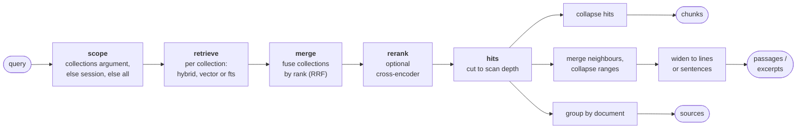
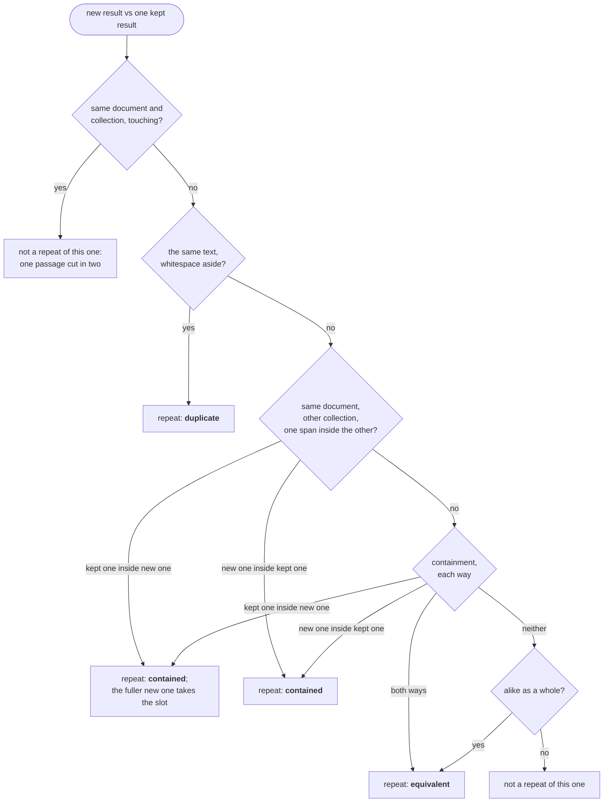

# Search

`search_excerpts`, `search_sources` and `GET /api/search/explore` share one ranking, then run the
fold their answer needs. `search/flow.py` builds these pipelines in one screen. Two more endpoints
search on their own paths: `/api/collections/{c}/search` asks one collection's index directly,
and `/api/search/text` is a separate BM25 search. Neither merges collections or folds repeats.

## The shared ranking

1. **Scope.** The `collections` argument, else the session's collections, else all of them.
2. **Retrieve.** Each collection runs `hybrid` (vector and BM25, fused), `vector` or `fts`.
   Fusion is `rrf` (reciprocal rank fusion) or `linear`. Without an embedding model everything is
   `fts`. The query is embedded once, and up to 8 collections are read in parallel.
3. **Merge** across collections by rank, because scores from two indexes are not comparable. A
   chunk that two collections share counts once. A search over one collection keeps that
   collection's own scores.
4. **Rerank** (optional). A cross-encoder rescores the merged `candidates`.

The ranking scans deeper than the answer. A folded repeat frees its slot for the next result,
several chunks go into one passage, and many into one source row.

## The four answers

| shape | what it is | who asks for it |
| --- | --- | --- |
| chunk (`Hit`) | one indexed chunk and its score | `explore?granularity=chunk`; also returned, without folding, by `/api/search/text` and `/api/collections/{c}/search` |
| passage | neighbouring matched chunks of one document, widened | `explore?granularity=passage` |
| excerpt | a passage without the parts that do not answer (today the same as a passage) | `search_excerpts`, `explore?granularity=excerpt` |
| source | one document: score, best chunk, hottest sections, collections | `search_sources` |

A passage widens to the nearest line break within 300 characters, else to whole sentences within
300 characters, else to the 300-character cap itself. So it usually starts and ends where the
author did, and can start or end mid-word where the cap stops it. Each one carries its `header`
(heading path) and its `location` (`doc p.3-4 L10-20`) to cite.

`search_sources` scores a document by the harmonic mean of its best chunk and the sum of all its
matched chunks. Every further chunk lifts the score, but the mean stays under twice the best
chunk. So a document that answers throughout outranks one that answers once, and weak mentions
cannot pile up without limit. It also returns a small set of collections that holds every
document listed, ready for `set_session_collections`. The set comes from the standard greedy
approximation of set cover, so it is small but not guaranteed smallest.

## Folding repeats

A pointwise reranker scores one passage at a time, so it cannot see that two results repeat each
other [1]. `search/collapse.py` folds them in the chunk and passage pipelines, once per search, as
the last fold before the answer. `search_sources` groups by document instead. The fold walks the
results best first and compares each one only with the results already kept (leader clustering).
Comparing only with kept results stops chains, so A close to B and B close to C never merges A
with C.

Each new result is compared with each kept result in turn:

A duplicate is an exact character match once whitespace is collapsed, in any document. Both texts need at least 7 words, so
two equal headings are not a point. Equivalent means the same meaning in other words: a nearly
identical vector, or nearly the same words where words decide.

A new result that repeats no kept result takes a new slot, while fewer than `limit` are taken.

The containment and alike tests run in up to two spaces, and the first space that finds a repeat
decides. A `vector` search decides by the embedding space alone, as it ranks by vectors alone.
Hybrid and full-text searches use both:

- **Embedding space**, used when every result has a vector and the model has duplicate
  thresholds. Containment is the mean of each chunk's best cosine against the other result.
  Alike is the cosine of the two results' mean vectors.
- **Word space**, always used. Containment is the share of one result's three-word shingles found
  in the other (threshold 0.8). Alike is the Jaccard of their words (threshold 0.5, a common
  near-duplicate line [1]). A result with fewer than 5 shingles never matches here.

Cosine thresholds are set per embedding profile (`duplicate_chunk` and `duplicate_passage` in
`catalogue/seed.sql`), because a raw cosine means different things for different models. The
current values are placeholders, not calibrated, and the seed file names their sources. A profile
without thresholds folds by words alone. The containment threshold is a
judgement call, and the code says so.

A folded result becomes an `also_in` entry under the result it repeats, and `also_in` is a tree.
When a fuller result takes a slot (the superset swap), the old one moves under it with everything
folded into it. Each place stays under the place it was measured against. Each entry carries its
`relation` to its parent. It also carries `to_parent` and `to_root`, measured by words and by
embedding: `contained`, `contains`, `alike`, and `score`, the harmonic mean of the two directions.
That score is the Dice coefficient for words and the F1 of the best chunk matches for embeddings.

## Full-text search

`GET /api/search/text` is one BM25 query over every collection, or over the comma-separated
`collections`, with no model and nothing to set up. It ignores the session's selection. Scores
are raw BM25, because one scorer with one tokenizer puts every collection on one scale. It is
paged with an offset cursor bound to the query (at most 1,000 results deep). A collection still
building its first full-text index contributes nothing instead of making the query wait.

## Settings

`limit`, `candidates`, `mode`, `fusion`, `rrf_k`, `vector_weight`, `bm25_weight`, `nprobes`,
`refine_factor`, `reranker` and `reranker_model` each have a user default and a description in
the UI, and a collection can override them. In the shared ranking, each collection retrieves with
its own overrides. The settings of the merged ranking (`rrf_k`, `candidates`, the reranker) come
from the collection only when it is the one collection in scope, and from the user otherwise.
`limit` comes from the call, else the user default. `/api/collections/{c}/search` applies all of
the collection's overrides, and also takes `limit`, `mode`, `fusion`, `vector_weight`,
`bm25_weight`, `reranker` and `candidates` per call.

Code: `search/flow.py`, `search/retrieval.py`, `search/passage.py`, `search/collapse.py`.

## References

1. Schlatt, F. et al. "Set-Encoder: Permutation-Invariant Inter-Passage Attention for Listwise
   Passage Re-Ranking with Cross-Encoders." *ECIR*, 2025. https://arxiv.org/abs/2404.06912
