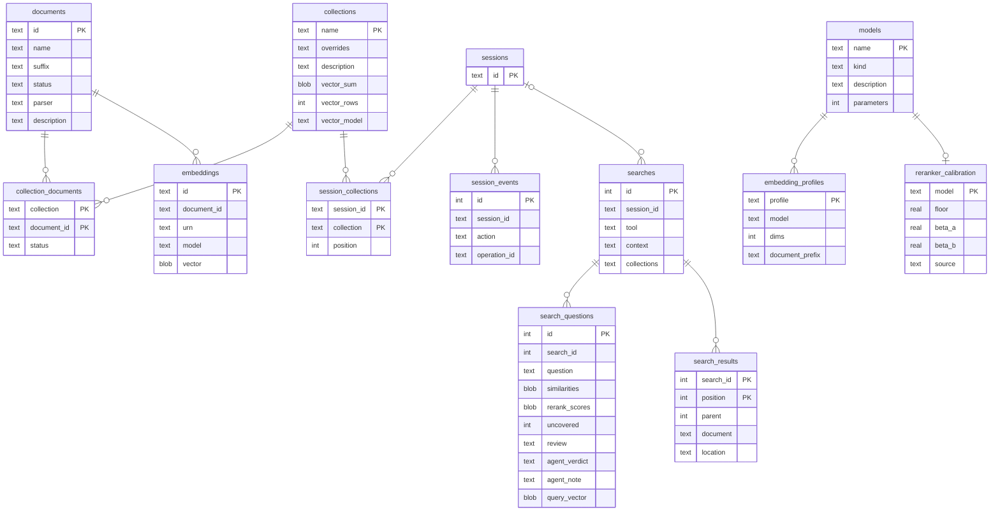

# Storage

Your data lives in one home directory, `~/.haskie` by default (`--home` or `HASKIE_HOME` moves
it). You can back it up, inspect it or delete it. Downloaded model weights are the exception:
they sit in the fastembed and Hugging Face caches, outside the home.

```
~/.haskie/
  haskie.db               SQLite (WAL): settings, documents, collections, memberships,
                          embedding metadata, sessions, the search log, installations, and the
                          DBOS tables
  haskie.lock             the home lock, naming the process that holds it
  server.log              output of a server that `haskie run` started
  staging/                uploads not yet imported; the nightly run sweeps those over a day old
  documents/<sh>/<id>/
    original.<ext>        the file as imported
    original.<ext>.md     the full conversion
    parts/NNNNNN.md       one per batch of PDF pages (one part for other files); every
                          collection re-chunks from these
    outline.json          the outline: every section, where it runs, its keywords
    preview/              the preview source and its markdown
    embeddings/<id>.parquet   one per chunk settings and model
    embeddings/<id>.tmp/      partial results while an embedding is computed
  collections/<sh>/<name>/index/   the LanceDB table "chunks"
  outlines/               LanceDB, one "nodes-<model>" table per embedding model (its
                          `cache_name`, `/@:` as `_`): every document's outline, with
                          vectors; "nodes-none", without vectors, for full-text search
  cache/models/           compiled CoreML models
  audit/                  one JSON line per action
```

`<sh>` is the first byte of the SHA-1 of the entry's key, in hex (`home.shard`): a document's id,
a collection's name. So 10,000 documents spread over 256 directories instead of filling one.

## The metadata database



`models` and `embedding_profiles` are the model catalogue (`catalogue/`). A fresh home fills them
once from `catalogue/seed.sql`, and the database holds them from then on. Settings name a profile
and a reranker model by key, checked against these tables when settings are written or read. How
a model loads stays in code: the loaders and their pinned revisions in `indexing/`.
`reranker_calibration` says how one reranker's scores read: the floor a search drops chunks under
when `min_rerank_score` is empty, and the beta curve `fill_values = absolute` spreads its scores
by. The seed gives every reranker an uncalibrated floor of 0.05 and the identity curve, until
`catalogue/calibrate.py` measures both on borderline pairs of your own collections.

`documents.id` is the MD5 of the original file. The bytes are the document, so the same file is
never imported twice. Every table, the LanceDB rows, the folders and the workflow ids refer to a
document by this id. `documents.name` is what people and agents call it. The API and the tools
address a document by name. It is unique, and stored in lowercase-kebab-case.
`embeddings.vector` is the document as one vector: the mean of its unit chunk vectors, not
normalized. Its direction is what the nearest documents are found by. Its length is how tightly
the chunks point one way, which the collection's mean needs: maintenance sums the members' means,
each weighted by its chunk count, into `collections.vector_sum`, with the chunks it sums in
`vector_rows` and the model in `vector_model`. A map of sections centres its cosines on that mean
([Search](search.md#sections-a-map-of-the-shelf)).

`searches` is the search log (`search/log.py`): one row per search, with or without a session,
failed or not. `search_questions` holds each question it asked and what that question's ranking
measured, and `search_results` every place it returned, folded places included. A session's
history reads its searches from here and its other actions from `session_events`. The Gaps page
judges the questions on read ([Gaps](gaps.md)). The nightly run deletes searches older than
`retention.search_days`.

Three more tables stand alone: `settings` (one row of JSON), `staging` (uploads waiting for a
name, with the MD5 of their bytes) and `installations` (each agent configuration directory that
`haskie install` wrote the skill and rule into, rewritten when a collection changes; see
[MCP](mcp.md)). DBOS keeps its own workflow and queue tables in the same file. `sysdb.py` reads
them for the Operations view, through `table()` declarations of its own: DBOS owns their schema.

Every table and index is a SQLAlchemy Core `Table` in `tables.py`, the one source of the schema.
`db.migrate` generates the DDL from it on a fresh home, and every query is a Core statement over
the same tables, so a column name is written once. Index names start with `idx_`. A home created
before `tables.py` keeps its older, unprefixed names.

## The outline

Each document has one outline, whichever collections hold it (`outline/`). It is kept twice:

- **`outline.json`**, beside the markdown: every section in document order, where it runs, by the
  fields a chunk names its span with (`headings`, lines, chars, bytes, pages), and its keywords
  with how often it uses each. It names the embedding model it was built under. `document_outline`
  and `search_sections` read it.
- **`outlines/`**, one LanceDB table per embedding model, across every collection: the same nodes,
  one row each, keyed by `document_id` and `position`, each with its vector when there is a model.
  The vector is the mean of the section's unit chunk vectors, scaled to length one. A model change
  drops no table, so a document's rows wait for the model to change back. Every boot and the nightly
  run compact them.

`ensure_embedding` builds it from the first cache entry it finds or computes while the document
has no outline under the model. That is the import's, under the default chunk settings, unless
the model changed since: then it is whichever entry the document gets first under the new
model, or an old one when the model changed back. A reconversion or a delete drops both.

## How each store is written

| store | how it is written | why |
| --- | --- | --- |
| SQLite | app code through SQLAlchemy Core on `aiosqlite`, one connection per unit of work (`NullPool`); DBOS through its own connections; WAL mode | a unit of work is one transaction. A unit that writes (`db.connect`) takes the write lock at its start (`begin immediate`), so a check it reads still holds when it writes. Writers that meet, and DBOS's writers, wait on the busy timeout, then fail with "database is locked". A unit that only reads (`db.read`) takes no lock: a deferred transaction reads one snapshot, waits for no writer, and refuses any write (`query_only`) |
| LanceDB | async API. A collection's table: one writer per collection (`task.indexing`). An outline table: one `merge_insert` per document, from any embedding run, one run per document at a time | one writer per table keeps commits simple. An outline write touches one document's rows, and LanceDB retries commits that conflict |
| small files | `home.atomic_write`: a temp file, flushed to disk, then `os.replace` | a crash or a power cut leaves the old file or the new one, never half |
| imported originals | moved or copied into place | removed again if the import raises |

## Schema changes

Before 1.0 there are no migrations. A storage change edits `tables.py` and bumps `SCHEMA_VERSION`
in `db.py`, which is stored in `PRAGMA user_version`. A home written with another version is
refused at startup, with a message that says so. The fix is `haskie destroy` and a fresh import.

A collection's LanceDB table records the embedding its vectors were made by (the `cache_name`, in
its schema metadata). A table of another embedding, or one from before the record, is outdated:
the collection shows it, and *Index all* rebuilds it from the embedding cache. No re-import is
needed. The outline index needs no such record: each model has its own table.

Code: `tables.py`, `db.py`, `catalogue/catalogue.py`, `catalogue/seed.sql`, `home.py`, `sysdb.py`.
