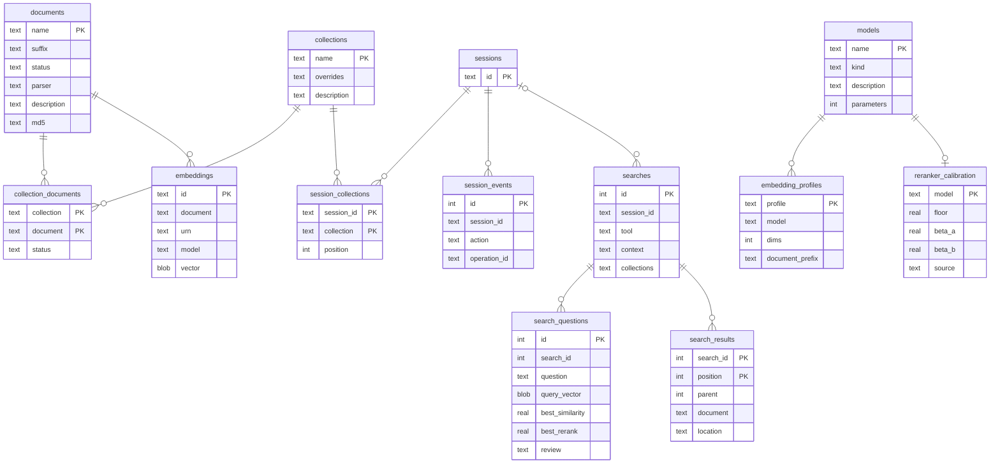

# Storage

Your data lives in one home directory, `~/.haskie` by default (`--home` or `HASKIE_HOME` moves
it). You can back it up, inspect it or delete it. Downloaded model weights are the exception:
they sit in the fastembed and Hugging Face caches, outside the home.

```
~/.haskie/
  haskie.db               SQLite (WAL): settings, documents, collections, memberships,
                          embedding metadata, sessions, the search log, and the DBOS tables
  haskie.lock             the home lock, naming the process that holds it
  server.log              output of a server that `haskie ensure` started
  staging/                uploads not yet imported; the nightly run sweeps those over a day old
  documents/<sh>/<doc>/
    original.<ext>        the file as imported
    original.<ext>.md     the full conversion
    parts/NNNNNN.md       one per batch of PDF pages (one part for other files); every
                          collection re-chunks from these
    preview/              the preview source and its markdown
    embeddings/<id>.parquet   one per chunk settings and model
    embeddings/<id>.tmp/      partial results while an embedding is computed
  collections/<sh>/<name>/index/   the LanceDB table "chunks"
  cache/models/           compiled CoreML models
  audit/                  one JSON line per action
```

`<sh>` is the first byte of the SHA-1 of the name, in hex (`home.shard`). So 10,000 documents
spread over 256 directories instead of filling one.

## The metadata database



`models` and `embedding_profiles` are the model catalogue (`catalogue/`). A fresh home fills them
once from `catalogue/seed.sql`, and the database holds them from then on. Settings name a profile
and a reranker model by key, checked against these tables when settings are written or read. How
a model loads stays in code: the loaders and their pinned revisions in `indexing/`.
`reranker_calibration` says how one reranker's scores read: the floor a search drops chunks under
when `min_rerank_score` is empty, and the beta curve `fill_values = absolute` spreads its scores
by. The seed gives every reranker an uncalibrated floor of 0.05 and the identity curve, until
`catalogue/calibrate.py` measures both on borderline pairs of your own collections.

`documents.md5` is the MD5 of the original file, so a second upload of the same bytes is spotted.
`embeddings.vector` is the document as one vector: the mean of its unit chunk vectors,
normalized. It is what the nearest documents are found by.

`searches` is the search log (`search/log.py`): one row per search, with or without a session,
failed or not. `search_questions` holds each question it asked and what that question's ranking
measured, and `search_results` every place it returned, folded places included. A session's
history reads its searches from here and its other actions from `session_events`. The Gaps page
judges the questions on read ([Gaps](gaps.md)). The nightly run deletes searches older than
`retention.search_days`.

Two more tables stand alone: `settings` (one row of JSON) and `staging` (uploads waiting for a
name, with the MD5 of their bytes). DBOS keeps its own workflow and queue tables in the same file. `sysdb.py` reads them for
the Operations view, through `table()` declarations of its own: DBOS owns their schema.

Every table and index is a SQLAlchemy Core `Table` in `tables.py`, the one source of the schema.
`db.migrate` generates the DDL from it on a fresh home, and every query is a Core statement over
the same tables, so a column name is written once. Index names start with `idx_`. A home created
before `tables.py` keeps its older, unprefixed names.

## How each store is written

| store | how it is written | why |
| --- | --- | --- |
| SQLite | app code through SQLAlchemy Core on `aiosqlite`, one connection per unit of work (`NullPool`); DBOS through its own connections; WAL mode | a unit of work is one transaction. Writers that meet wait on the busy timeout |
| LanceDB | async API, one writer per collection (`task.indexing`) | one writer per table keeps commits simple |
| small files | `home.atomic_write`: a temp file, then `os.replace` | a crash leaves the old file or the new one, never half |
| imported originals | moved or copied into place | removed again if the import raises |

## Schema changes

Before 1.0 there are no migrations. A storage change edits `tables.py` and bumps `SCHEMA_VERSION`
in `db.py`, which is stored in `PRAGMA user_version`. A home written with another version is refused at startup, with a message
that says so. The fix is `haskie destroy` and a fresh import.

Code: `tables.py`, `db.py`, `catalogue/catalogue.py`, `catalogue/seed.sql`, `home.py`, `sysdb.py`.
