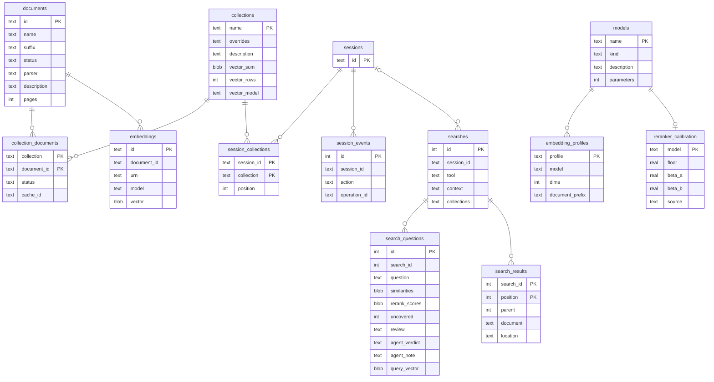

# Storage

Your data lives in one home directory, `~/.haskie` by default (`--home` or `HASKIE_HOME` moves
it). You can back it up ([Backup and restore](#backup-and-restore)), inspect it or delete it.
Downloaded model weights are the exception: they sit in the Hugging Face cache, outside the home:
the ONNX models under `haskie-onnx` in it, as plain files, since ONNX Runtime refuses external
data behind the cache's links.

```
~/.haskie/
  haskie.db               SQLite (WAL): settings, documents, collections, memberships,
                          embedding metadata, sessions, the search log, installations, and the
                          DBOS tables
  haskie.lock             the home lock, naming the process that holds it
  server.log              output of a server that `haskie run` started
  staging/                uploads not yet imported; the nightly run sweeps those over a day old
  backups/                the newest backup archive
  restoring/<key>/        a restore's upload, its unpacked archive and the contents it replaced,
                          while it runs
  documents/<sh>/<id>/
    original.<ext>        the file as imported
    original.<ext>.md     the full conversion
    parts/NNNNNN.md       one per convert batch of PDF pages (one part for other files),
                          joined into the full conversion
    preview/              the preview source and its markdown
    cover.jpg             the picture behind its card, built on first request
    embeddings/<id>.chunks.parquet     the chunks, one file per chunk settings and model
    embeddings/<id>.sections.parquet   their sections: ids, where each runs, descriptors
    embeddings/<id>.tmp/               partial results while an embedding is computed
  collections/<sh>/<name>/
    index/                the LanceDB table "chunks"
  cache/models/           compiled CoreML models
  audit/                  one JSON line per action
```

`<sh>` is the first byte of the SHA-1 of the entry's key, in hex (`home.shard`): a document's id,
a collection's name. So 10,000 documents spread over 256 directories instead of filling one.

## The metadata database



`models` and `embedding_profiles` are the model catalogue (`catalogue/`). A fresh home fills them
once from `catalogue/seed.sql`, and the database holds them from then on. Settings name a profile
and a reranker model by key, checked against these tables when settings are written or read. How
a model loads stays in code: the loaders and their pinned revisions in `indexing/`.
`reranker_calibration` says how one reranker's scores read: the floor a search drops chunks under
when `min_rerank_score` is empty, and the beta curve `fill_values = absolute` spreads its scores
by. The seed gives every reranker an uncalibrated floor of 0.05 and the identity curve, until
`catalogue/calibrate.py` measures both on borderline pairs of your own collections.

`documents.id` is the MD5 of the original file, in base58 like section and chunk ids (see below).
The bytes are the document, so the same file is never imported twice. Every table, the LanceDB
rows, the folders and the workflow ids refer to a document by this id. `documents.name` is what
people and agents call it. The API and the tools address a document by name. It is unique, and
stored in lowercase-kebab-case.
`embeddings.vector` is the document as one vector: the mean of its unit chunk vectors, not
normalized. Its direction is what the nearest documents are found by. Its length is how tightly
the chunks point one way, and the collection's mean needs it. Maintenance sums the members'
means, each weighted by its chunk count, into `collections.vector_sum`. It keeps the number of
chunks it sums in `vector_rows` and the model in `vector_model`. A map of sections centres its
cosines on that mean ([Search](search.md#sections-a-map-of-the-shelf)).

`searches` is the search log (`search/log.py`): one row per search, with or without a session,
failed or not. `search_questions` holds each question it asked and what that question's ranking
measured, and `search_results` every place it returned, folded places included. A session's
history reads its searches from here and its other actions from `session_events`. The Gaps page
judges the questions on read ([Gaps](gaps.md)). The nightly run deletes searches older than
`retention.search_days`.

Three more tables stand alone: `settings` (one row of JSON), `staging` (uploads waiting for a
name, with the MD5 of their bytes) and `installations` (each agent configuration directory that
`haskie install` wrote the skill and rule into, rewritten when a collection changes; see
[MCP](mcp.md)). DBOS keeps its own workflow and queue tables in the same file. `sysdb.py` reads
them for the Operations view, through `table()` declarations of its own. DBOS owns their schema.

Every table and index is a SQLAlchemy Core `Table` in `tables.py`, the one source of the schema.
`db.migrate` generates the DDL from it on a fresh home, and every query is a Core statement over
the same tables, so a column name is written once. Index names start with `idx_`.

## Sections and their ids

Every section and every chunk has an id, named when a computed embedding is merged
(`embed_cache._merge`, `sections/build.py`). The merge is the first place that sees the whole
document in order.

- Each of these ids is an MD5 written in base58 (`ids.py`), 22 characters: letters and digits
  without `0`, `O`, `I` and `l`, padded with `1`, the zero digit.
- A section is a run of chunks under one heading path, the whole document first. Its id is the
  MD5 of `<document id>/s/<position>`, its place among the document's sections, 0 for the whole
  document. Sections are cut by heading paths alone, so other chunk settings mostly give the same
  sections the same ids. Each section names the one it sits in (`parent_id`).
- A chunk's id is the MD5 of `<document id>/c/<seq>`, its 1-based place among the document's
  chunks: under other chunk settings the same `seq`, and so the same id, names other text. Each
  chunk names every section that holds it, the whole document first and its own section last
  (`section_ids`), so a search kept to a chapter finds the chunks of its subsections too.
- The `s` and `c` keep the two kinds apart: section 2 and chunk 2 of one document are two ids.

The sections go into their own file beside the chunks (`<id>.sections.parquet`), each with its
id, parent, headings, where it runs and its descriptors. The file is written before the entry's
row, so a cache hit has both. Its schema metadata names the strategy that wrote the descriptors
(`descriptors`); a file the merge just wrote has none, until the describe step rewrites it. Each chunking of a document keeps its own, as its section ids are
its own. A membership names the entry its rows were indexed from
(`collection_documents.cache_id`). So `search_sections` reads the descriptors of the sections a
collection's ids name, even after its chunk settings change and before *Index all* re-chunks it.
The collection's centre sums its members' entries the same way. A reconversion or a delete drops
the sections with the cache. Deleting an entry empties the pointer to it (a foreign key, `on
delete set null`) until the member is indexed again.

## How each store is written

| store | how it is written | why |
| --- | --- | --- |
| SQLite | app code through SQLAlchemy Core on `aiosqlite`, one connection per unit of work (`NullPool`); DBOS through its own connections; write-ahead log (WAL) mode | a unit of work is one transaction. A unit that writes (`db.connect`) takes the write lock at its start (`begin immediate`), so a check it reads still holds when it writes. Writers that meet, and DBOS's writers, wait on the busy timeout, then fail with "database is locked". A unit that only reads (`db.read`) takes no lock: a deferred transaction reads one snapshot, waits for no writer, and refuses any write (`query_only`) |
| LanceDB | async API; a collection's table: one writer per collection (`task.indexing`) | one writer per table keeps commits simple |
| small files | `home.atomic_write`: a temp file, flushed to disk, then `os.replace` | a crash or a power cut leaves the old file or the new one, never half |
| imported originals | moved or copied into place | removed again if the import raises |

## Backup and restore

*Back up* in the settings makes one zip of the contents, as an operation of its own: the rows of
`settings`, `collections`, `documents`, `embeddings` and `collection_documents` (a database of
their own, `haskie.db`), and each document's original, its markdown and its embedding cache. A
document being deleted is left out. Only the newest archive is kept, under `backups/`.

What a machine makes for itself stays out: the LanceDB indexes, previews, covers and convert
parts, the model catalogue, and the history (DBOS's runs, sessions, the search log, the audit
trail).

*Restore* replaces the contents with an archive's and keeps the history. A session keeps the
collections it chose that the archive holds. It is refused while other work runs, and for an
archive of another schema version. The rows are replaced in one transaction and the folders
swapped beside it, so a failure leaves what was there. While it runs, every request but a GET
gets 503, MCP calls included. Every collection is then indexed again from the restored embedding
cache, with nothing embedded again if the settings name the same model, and every document the
backup caught mid-import is imported again. Both are durable workflows: after a crash they resume
at the step they stopped in. The nightly round removes the upload of a restore that never ran,
such as one cancelled while it waited.

Code: `backup.py`.

## Schema changes

Before 1.0 there are no migrations. A storage change edits `tables.py` and bumps `SCHEMA_VERSION`
in `db.py`, which is stored in `PRAGMA user_version`. A home written with another version is
refused at startup, with a message that says so. The fix is `haskie destroy` and a fresh import.

A collection's LanceDB table records the embedding its vectors were made by (the `cache_name`, in
its schema metadata). A table of another embedding, or one from before the record, is outdated:
the collection shows it, and *Index all* rebuilds it from the embedding cache. No re-import is
needed.

Code: `tables.py`, `db.py`, `catalogue/catalogue.py`, `catalogue/seed.sql`, `home.py`, `sysdb.py`.
