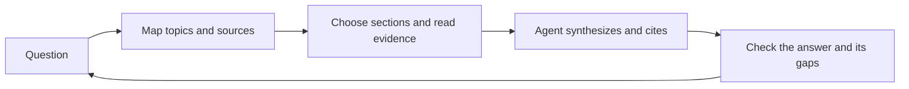

# Why haskie exists

haskie gives coding agents access to the sources you choose. Those sources can hold technical
knowledge, domain expertise and personal taste: a programming book, a returns policy, a research
paper or a design reference. You curate the library. The agent retrieves evidence from it and
uses that evidence to reason about your work.

This page explains the reasons behind that design. Research results below belong to the studies
that measured them. They are not measurements of haskie or guarantees about an agent's answers.

## Your choices belong in the context

A model's training does not tell it which engineering trade-offs your team accepts, which policy
applies to your product or which designs you admire. A collection makes those choices explicit.
Descriptions help an agent choose where to look. Citations let you check what it used.

There is evidence that shared AI suggestions can narrow the range of outputs. Doshi and Hauser
found that access to generative AI ideas improved ratings of individual short stories while making
the stories more similar to one another. Their short-story experiment gives us a reason to
preserve distinct source choices. Whether that improves coding-agent output needs its own evaluation.
See the [authors' paper](https://arxiv.org/abs/2312.00506) and its
[Science Advances publication](https://doi.org/10.1126/sciadv.adn5290).

Shumailov and colleagues studied a different problem: models trained recursively on generated
data can lose parts of the original distribution. That is a training result. It does not mean
that reading an AI-written page causes an agent to collapse, or that retrieval fixes model
training. It supports keeping access to original material rather than relying only on successive
retellings. See the [authors' paper](https://arxiv.org/abs/2305.17493) and its
[Nature publication](https://doi.org/10.1038/s41586-024-07566-y).

Our product choice is to make a user's sources available alongside the agent's general knowledge.
Those sources can disagree. The agent should explain that disagreement rather than hide it.

## Web availability does not establish source quality

The open web remains useful for current information and for topics your library does not cover.
Its breadth also makes source selection necessary. Three investigations illustrate the problem:

- Graphite's analysis estimated that roughly half of newly published articles in its sample
  were primarily AI-generated by early 2026. The estimate depends on its sampling and detection
  method. It is not a count of half of all existing web content.
  [Study and methodology](https://graphite.io/five-percent/research/ai-now-writes-as-many-online-articles-as-humans-do).
- Ahrefs classified 74.2% of 900,000 English-language pages as containing some AI-generated text.
  It sampled one newly detected page per domain in April 2025. “Some AI text” differs from
  “primarily AI-generated,” so the two studies measure different things.
  [Study and detector method](https://ahrefs.com/blog/what-percentage-of-new-content-is-ai-generated/).
- NewsGuard's AI Tracking Center documents content-farm sites and examples of generated false
  claims. Its page listed 3,749 sites when checked on 8 October 2026. This is a changing tracker,
  not an estimate of the whole web.
  [Tracker and inclusion criteria](https://www.newsguardtech.com/special-reports/ai-tracking-center/).

These are industry investigations. An AI-content detector is not a truth detector. Human-written
material can be wrong too. haskie lets you choose and inspect the sources rather than treating
their search rank or writing style as evidence of quality.

## An answer needs evidence you can inspect

In the 2025 Stack Overflow survey, 46% of respondents distrusted AI output accuracy. Answers that
were nearly correct frustrated 66%. These are reported experiences, not a benchmark of every
model. They explain why a usable answer needs a way to check it.
[Survey questions and results](https://survey.stackoverflow.co/2025/ai).

The Tow Center tested eight AI search tools on identifying news articles from supplied excerpts.
The tools collectively answered more than 60% of those queries incorrectly. That result concerns
article identification under the study's conditions, not all searches or all coding tasks.
[Study by Jaźwińska and Chandrasekar](https://www.cjr.org/tow_center/we-compared-eight-ai-search-engines-theyre-all-bad-at-citing-news.php).

NewsGuard's August 2025 audit of ten tools found they repeated false news claims in 35% of its
tests, compared with 18% a year earlier. The report discusses a simultaneous decline in refusals
as tools adopted web search. This comparison does not isolate web search as the sole cause.
[Audit and methodology](https://www.newsguardtech.com/ai-monitor/august-2025-ai-false-claim-monitor/).

haskie returns source passages with document names, heading paths and line ranges. PDFs also
retain page references. The agent can cite those locations, and you can inspect the original
context in Explore. A citation makes a claim checkable. It does not make it true.

## Retrieved text is still untrusted input

OWASP describes prompt injection through external content as a risk for language-model
applications. Choosing what to import reduces the set of sources you must assess. It does not
turn document text into safe instructions.
[OWASP LLM01:2025](https://genai.owasp.org/llmrisk/llm01-prompt-injection/).

The PoisonedRAG researchers demonstrated targeted attacks against retrieval systems. In their
experiments, five malicious texts per target question could produce a 90% attack success rate in
a database of millions of texts.
[Paper, USENIX Security 2025](https://arxiv.org/abs/2402.07867).

haskie does not fact-check imported documents or guarantee protection from prompt injection.
Agents must treat retrieved passages as evidence to assess. The search-first rule asks an agent
to say when the library cannot answer and then seek other sources.

## A larger context still needs selection

Supplying an entire document can work for a small task. A growing library creates a different
problem: the agent must choose which material deserves its limited context.

Liu and colleagues found that performance on question answering and key-value retrieval depended
on where relevant information appeared. In the models they tested, information in the middle of
long contexts was often harder to use. [Lost in the Middle](https://arxiv.org/abs/2307.03172).

Chroma's 2025 technical report tested 18 models on controlled tasks. It found that increasing
input length could reduce reliability even when the task stayed simple.
[Context Rot](https://www.trychroma.com/research/context-rot).

Anthropic's context-engineering guidance recommends selecting useful context and loading more
as an agent needs it. Its discussion of progressive discovery also explains how metadata can
guide the next retrieval decision.
[Effective context engineering for AI agents](https://www.anthropic.com/engineering/effective-context-engineering-for-ai-agents).

haskie applies that idea through section maps and focused excerpts. It joins neighbouring hits,
folds repeats and retains citations. The aim is to spend context on distinct evidence and let the
agent read further when needed. See [search](search.md) for the mechanisms and their limits.

## Discovery and synthesis form a loop

“Discovery–Synthesis Loop” is haskie's name for its intended agent workflow. Two established
models of human research inform it.

Carol Kuhlthau's Information Search Process describes six stages: initiation, selection,
exploration, formulation, collection and presentation. Its account of uncertainty and focus
formation explains why a researcher may need to explore before asking a precise question.
[Kuhlthau's description and research history](https://wp.comminfo.rutgers.edu/ckuhlthau/information-search-process-theory/).

Eisenberg and Berkowitz's Big6 model covers task definition, information-seeking strategies,
location and access, use of information, synthesis and evaluation. It explicitly includes
organizing information from multiple sources and judging both the result and the process.
[The Big6 skills](https://thebig6.org/translations).

Section descriptors suggest useful terms and related sections. Document and collection summaries
help an agent judge scope. The agent chooses what to read, connects the evidence and refines its
question. A precise question can start with excerpts. Gaps records missing coverage so the user
can add sources and test those questions again.

The [mission](../README.md#mission) also calls for a knowledge graph that links related topics
beyond vector proximity. This is a development direction. Today's section maps, `related`
sections and `also_in` repeat relations are described in [search](search.md); they should not be
read as a general graph of conceptual relationships.

## The retrieval work should not become your second project

A usable library needs conversion, chunking, embeddings, search, citations, previews and recovery
when work stops. haskie combines those pieces with a UI for curation and MCP tools for agents.
Documents can serve several collections without repeated import. Shared embedding caches avoid
repeating compatible work. Durable jobs resume after interruptions, and a CPU budget limits
background processing.

Local retrieval keeps storage and search under your control. The connected agent receives the
passages it requests and may send them to its model provider. Choose the agent and its data
settings to suit the material you import.

Start with [setup](setup.md) and the [user guide](user-guide.md). The technical reasons for
structure-aware chunking, hybrid search and duplicate folding live beside their implementations
in [chunking](chunking.md), [search](search.md), [storage](storage.md) and [indexing](indexing.md).
